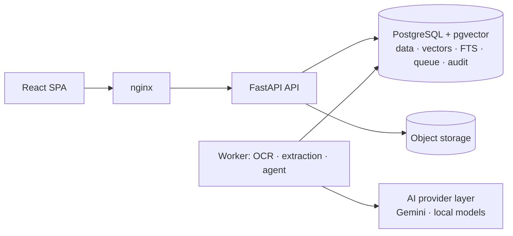

# Enterprise Document Intelligence Platform

Multimodal AI for document understanding, verification, RAG, agentic reasoning and
human-in-the-loop workflow automation — built as a compact, enterprise-grade platform rather
than an OCR demo or LLM wrapper.

> **Status: Phase 3 complete — ingestion, OCR, layout, tables and classification.**
> Field extraction, comparison, RAG, the agent and workflows are designed
> (see [`docs/`](docs/README.md)) and are implemented in Phases 4–11. Nothing below claims a
> capability that has not been built and tested.

## What the platform will do

Upload invoices, purchase orders, contracts, receipts, delivery notes, policies and forms →
classify → extract schema-validated fields with page-level evidence → normalize → compare
documents with deterministic rules → retrieve company policy with cited RAG → let an agent
investigate discrepancies with controlled tools → route recommendations to human approval →
record everything in an append-only audit trail.



Key design decisions (full list in the [decision log](docs/architecture/13-decision-log.md)):
deterministic facts always override AI output; confidence comes from measured signals, never
LLM self-assessment; the agent can only *propose* high-impact actions; PostgreSQL is the
single stateful service (no Redis, no external vector DB); every AI provider sits behind an
interface; sensitive documents are never sent to free-tier external AI.

## What works today (Phases 0–3, verified by tests)

| Area | Implemented |
|---|---|
| Backend foundation | FastAPI app factory, typed settings with environment-aware secret validation, structured JSON logging with secret redaction, request IDs, security headers, RFC 9457 error responses (no internals leak, even on crashes) |
| Health | `/health` liveness, `/health/ready` checks database reachability **and** that the schema is at the migration head of the running build |
| Database | SQLAlchemy 2 (async, psycopg 3) + Alembic; `vector` extension; identity and audit tables; audit log is **append-only at the database level** (trigger rejects UPDATE/DELETE/TRUNCATE); migration round-trip and model/migration drift are tested |
| Auth & RBAC | argon2id passwords, JWT with strict claim validation, uniform login errors + timing equalization (no account enumeration), DB-backed lockout, roles re-read on every request, code-defined permission matrix, audited authorization denials |
| AI provider layer | `LLMProvider` / `EmbeddingProvider` interfaces, Gemini implementations on `google-genai` 2.x with structured output validation, malformed-JSON handling, error taxonomy, retries, client-side rate limiting, 768-d normalized embeddings — tested through the real SDK with HTTP mocked at the transport |
| Document upload | `POST /api/v1/documents` for PDF, PNG, JPEG and TIFF. Type taken from the file content and required to match the extension and declared type; corrupt, password-protected, oversized, too-many-pages and decompression-bomb files rejected before storage; filenames sanitized; exact duplicates flagged; file, version, job and audit row created atomically |
| Document access | List with filters and pagination, detail, download (attachment, `nosniff`, sandbox CSP), soft delete, reprocess. Department-scoped access as SQL predicates, so documents outside your scope return 404 |
| Storage | `DocumentStorage` interface with local filesystem (path confinement, atomic writes) and S3-compatible (AWS S3, R2, MinIO) backends |
| Job queue & worker | PostgreSQL queue (`SKIP LOCKED`, leases + heartbeats, retries with backoff, `LISTEN/NOTIFY` wake-up); worker re-verifies the file's SHA-256 and inspects every page: native text vs. needs OCR, size, rotation, images. Crash recovery and lease ownership are tested |
| Text extraction & OCR | Per page: the PDF text layer (word boxes in the displayed orientation) or Tesseract 5 OCR with upscaling of low-DPI images, projection-profile deskew, orientation correction, token clean-up; page preview images |
| Layout & tables | Lines, column segments, reading-order blocks, label/value grids; geometry-based tables for native and scanned pages, stitched across pages |
| Classification | Nine document types: local calibrated TF-IDF + logistic-regression model (trained at worker start from a synthetic corpus plus human corrections), LLM fallback with agreement-based confidence, human correction that later processing never overrides |
| AI safety gate | Content findings (card numbers, SSNs) and type minimums raise the effective sensitivity; above `AI_EXTERNAL_MAX_SENSITIVITY` no text reaches an external model; uncertain or unreadable documents go to review with a reason |
| Synthetic data | Seeded generator for linked purchase orders, delivery notes and invoices (12 scenarios, incl. price/quantity/tax/vendor defects, duplicates, multi-page and scanned documents) with JSON ground truth; `make process` ingests a dataset through the API |
| CLI | `docintel seed`, `create-user`, `check-ai` (real end-to-end key verification), `check-ocr`, `worker`, `worker-health`, `generate-documents`, `ingest`, `evaluate` |
| Frontend | React 19 + TypeScript + Tailwind 4: login, protected routes, session expiry, documents inbox with upload, type/status filters and paging, document detail with review reasons, classification evidence and correction, page viewer (preview, word boxes, text), tables, processing timings, download, reprocess, delete; system status page |
| Delivery | Non-root multi-stage images, docker compose (db, migrate, api, worker, web) with health-checked startup ordering, nginx with strict CSP, smoke test incl. a processed upload, GitHub Actions CI (lint, types, migrations, tests, dependency audits, secret scan, container smoke test, synthetic dataset ingest) |

Test suites: 399 backend tests (unit, integration against real PostgreSQL, security) and 24
frontend tests.

## Quick start

Prerequisites: Docker, [uv](https://docs.astral.sh/uv/), Node.js 22, make, and Tesseract 5 for
running the worker or tests on the host (`apt install tesseract-ocr` / `brew install tesseract`;
the Docker image includes it).

```bash
make env        # .env with a generated JWT secret
# edit .env: SEED_USER_PASSWORD (12+ chars) and GEMINI_API_KEY (https://aistudio.google.com/apikey)
make setup      # install dependencies
make seed       # Postgres in Docker + migrations + demo users
make dev        # API :8000 + worker + UI http://localhost:5173
```

Or the production-like stack: `make up && make seed-docker && make smoke` → http://localhost:8080.

Try it with synthetic documents: `make generate-documents && make process`
(add `API_URL=http://localhost:8080` for the Docker stack), then open the Documents page.

Verify your Gemini key: `make check-ai`. **Free-tier note:** Google's unpaid-tier terms allow
prompts to be used for product improvement and human review — use synthetic documents only.
Details: [local setup](docs/development/local-setup.md) · [configuration](docs/development/configuration.md).

## Evaluation

All numbers below come from `make evaluate` at commit `f85f342` and are measured on
**synthetic data only**. Synthetic layouts are regular and the classifier's training and
test generators are related, so these numbers overstate real-world accuracy. Each report
lists its datasets, seeds, engine versions and caveats.

| Metric | Value | Report |
|---|---|---|
| OCR CER / WER, clean 300 DPI page | 1.2% / 1.5% (35 pages) | [ocr](evaluation/reports/ocr.md) |
| OCR CER / WER, light scan, 150 DPI | 2.3% / 3.2% | [ocr](evaluation/reports/ocr.md) |
| OCR CER / WER, heavy scan, 150 DPI | 10.4% / 14.9% | [ocr](evaluation/reports/ocr.md) |
| OCR CER / WER, 3° skew / 90° rotation | 2.0% / 3.2% · 2.7% / 3.5% | [ocr](evaluation/reports/ocr.md) |
| Classification accuracy / macro-F1, rendered native + scanned PDFs | 100% / 1.000 (n = 90) | [classification](evaluation/reports/classification.md) |
| Classification accuracy, first 300 characters only | 99.7% (n = 900); 0.0% error in the auto-accepted bucket | [classification](evaluation/reports/classification.md) |
| Classification LLM fallback | Not yet measured (needs a Gemini key) | |
| Line-item tables, native PDFs: rows exact / cell accuracy | 100% / 100% (70 documents) | [tables](evaluation/reports/tables.md) |
| Line-item tables, scanned at 150 DPI: row recall / cell accuracy | 0.894 / 83.8% (70 documents) | [tables](evaluation/reports/tables.md) |
| Field extraction exact / normalized match | Not yet measured | |
| Retrieval Recall@k / MRR / nDCG | Not yet measured | |
| Agent task success / tool-selection accuracy | Not yet measured | |
| Latency / throughput / cost per document | Not yet measured | |

Preprocessing choices were made by ablation, which is also in the OCR report. Without
upscaling, a 100 DPI page goes to 7.1% CER and 18.7% WER. Without deskew, a 3° page goes to
3.7% CER and 9.8% WER. Removing ruling lines made results worse, so it is off by default.
Scanned tables are the weakest area today, and the dataset's own four scanned documents
have too few rows to be meaningful (see the tables report).
See the [evaluation plan](docs/architecture/10-evaluation-plan.md).

## Roadmap

| Phase | Scope | Status |
|---|---|---|
| 0 | Architecture & foundation (includes the master prompt's Phase 1) | **Complete** |
| 2 | Document ingestion: upload validation, storage abstraction, Postgres job queue, worker, synthetic generator | **Complete** |
| 3 | OCR & understanding: native text + Tesseract OCR on the pages that need it, layout, tables, classification, sensitivity gate | **Complete** |
| 4 | Structured extraction: schemas, evidence verification, normalization, confidence, vision for low-confidence pages | Next |
| 5 | Comparison & rule engine, duplicates, review queue | Planned |
| 6 | Knowledge base & hybrid RAG with citations | Planned |
| 7 | LangGraph agent, controlled tools, MCP server | Planned |
| 8 | Workflows, human approval, reports, audit API | Planned |
| 9 | Full enterprise UI | Planned |
| 10 | Evaluation harness & reproducible demo | Planned |
| 11 | Productionization & deployment | Planned |

## Repository layout

```
backend/     Python package `docintel` (API, worker, CLI; MCP server in Phase 7), tests
synthetic_data/  generated datasets (git-ignored output of `make generate-documents`)
frontend/    React SPA + nginx image
docs/        architecture, decisions, development guides
scripts/     smoke test and helper scripts
.github/     CI
```

## License

[MIT](LICENSE)
