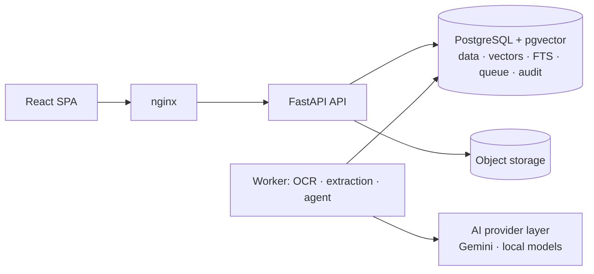

# Enterprise Document Intelligence Platform

Multimodal AI for document understanding, verification, RAG, agentic reasoning and
human-in-the-loop workflow automation — built as a compact, enterprise-grade platform rather
than an OCR demo or LLM wrapper.

> **Status: Phase 11 complete — the platform (ingestion, OCR, layout, tables, classification,
> structured extraction with evidence, comparison, business rules, duplicates, the review queue,
> contract versions, cited RAG, document search, the LangGraph agent with controlled tools and an
> MCP server, workflows with maker-checker approval, reproducible reports, the audit API, the web
> app, and the evaluation harness with regression gates) is now productionized: Prometheus
> metrics with alerts and a dashboard, per-caller rate limits, retention, hardened containers,
> architecture contracts, a staging/production configuration with release and deploy workflows,
> and a load test against the NFR-09 targets.** The deployment configuration was rehearsed on a
> local Docker host; **no staging or production deployment has been performed** and the GitHub
> workflows have not run yet. Nothing below claims a capability that has not been built and
> tested. Overview for reviewers: [project overview](docs/project-overview.md).

## What the platform will do

Upload invoices, purchase orders, contracts, receipts, delivery notes, policies and forms →
classify → extract schema-validated fields with page-level evidence → normalize → compare
documents with deterministic rules → retrieve company policy with cited RAG → let an agent
investigate discrepancies with controlled tools → route recommendations to human approval →
record everything in an append-only audit trail.



Key design decisions (full list in the [decision log](docs/architecture/13-decision-log.md)):
deterministic facts always override AI output; confidence comes from measured signals, never
LLM self-assessment; the agent can only *propose* high-impact actions; PostgreSQL is the
single stateful service (no Redis, no external vector DB); every AI provider sits behind an
interface; sensitive documents are never sent to free-tier external AI.

## What works today (Phases 0–11, verified by tests)

| Area | Implemented |
|---|---|
| Backend foundation | FastAPI app factory, typed settings with environment-aware secret validation, structured JSON logging with secret redaction, request IDs, security headers, RFC 9457 error responses (no internals leak, even on crashes) |
| Health | `/health` liveness, `/health/ready` checks database reachability **and** that the schema is at the migration head of the running build |
| Database | SQLAlchemy 2 (async, psycopg 3) + Alembic; `vector` extension; identity and audit tables; audit log is **append-only at the database level** (trigger rejects UPDATE/DELETE/TRUNCATE); migration round-trip and model/migration drift are tested |
| Auth & RBAC | argon2id passwords, JWT with strict claim validation, uniform login errors + timing equalization (no account enumeration), DB-backed lockout, roles re-read on every request, code-defined permission matrix, audited authorization denials |
| AI provider layer | `LLMProvider` / `EmbeddingProvider` interfaces, Gemini implementations on `google-genai` 2.x with structured output validation, malformed-JSON handling, error taxonomy, retries, client-side rate limiting, 768-d normalized embeddings — tested through the real SDK with HTTP mocked at the transport |
| Document upload | `POST /api/v1/documents` for PDF, PNG, JPEG and TIFF. Type taken from the file content and required to match the extension and declared type; corrupt, password-protected, oversized, too-many-pages and decompression-bomb files rejected before storage; filenames sanitized; exact duplicates flagged; file, version, job and audit row created atomically |
| Document access | List with filters and pagination, detail, download (attachment, `nosniff`, sandbox CSP), soft delete, reprocess. Department-scoped access as SQL predicates, so documents outside your scope return 404 |
| Storage | `DocumentStorage` interface with local filesystem (path confinement, atomic writes) and S3-compatible (AWS S3, R2, MinIO) backends |
| Job queue & worker | PostgreSQL queue (`SKIP LOCKED`, leases + heartbeats, retries with backoff, `LISTEN/NOTIFY` wake-up); worker re-verifies the file's SHA-256 and inspects every page: native text vs. needs OCR, size, rotation, images. Crash recovery and lease ownership are tested |
| Text extraction & OCR | Per page: the PDF text layer (word boxes in the displayed orientation) or Tesseract 5 OCR with upscaling of low-DPI images, projection-profile deskew, orientation correction, token clean-up; page preview images |
| Layout & tables | Lines, column segments, reading-order blocks, label/value grids; geometry-based tables for native and scanned pages, stitched across pages |
| Classification | Nine document types: local calibrated TF-IDF + logistic-regression model (trained at worker start from a synthetic corpus plus human corrections), LLM fallback with agreement-based confidence, human correction that later processing never overrides |
| AI safety gate | Content findings (card numbers, SSNs) and type minimums raise the effective sensitivity; above `AI_EXTERNAL_MAX_SENSITIVITY` no text reaches an external model (a self-hosted Ollama model is allowed: content stays in the deployment); uncertain or unreadable documents go to review with a reason |
| Structured extraction | Versioned schemas for invoices, purchase orders, receipts, delivery notes, contracts, resumes, bank statements and policies. A layout extractor (labels, letterhead, table columns) runs on every document; Gemini or a local Ollama model is consulted only when it is not confident, with schema-constrained output, one repair round-trip and caching. Every value carries page, quote and box and is verified against the page; values are normalized (Decimal amounts, ISO currency, explicit date-order rules, payment terms, vendor resolved against a vendor master by tax ID, alias or fuzzy name) and checked for consistency (line arithmetic, totals, tax, due date, balances) |
| Confidence & review | Field confidence from measured factors (evidence, normalization, OCR, rule strength, agreement, consistency), never model self-assessment; documents are auto-accepted, sent to analyst review or to mandatory review with reasons; a value only the model read is never auto-accepted on its own; reviewers correct values as printed, corrections are re-scored, survive reprocessing and are audited without values |
| Comparison (Phase 5) | Every processed invoice is matched with the purchase order it references and that order's delivery notes (two- and three-way match; delivered quantities summed over notes), every delivery note with its order — within the department, whatever the arrival order. Lines pair by item code, then by description. Each check is MATCH, MISMATCH, MISSING or UNCERTAIN with the difference, the tolerance and both documents' evidence (page, quote, box); a difference that rests on a weak reading or a misread item code is UNCERTAIN, not a discrepancy. Users can also compare documents of their choice |
| Business rules | 19 deterministic rules (prices, quantities ordered and delivered, lines not ordered, vendor, currency, tax rate, payment terms, missing or unknown order, arithmetic, mandatory fields, unknown vendor, delivery notes, contract expiry, payment-terms policy) with typed, validated parameters; tolerances live in the rules; administrators change parameters, severity or on/off (versioned, audited) and re-evaluate documents |
| Duplicates | Byte-identical files at upload; the same vendor and number (strong) or vendor, amount and a date within 7 days (possible) at matching; only older documents count as originals |
| Review queue | One task per document with every reason (processing, rule, duplicate), priority from severity, SLA due dates, claim/release, resolve as approved, corrected or rejected (with a note); accepted findings do not come back for that version, new ones do; tasks close by themselves when the findings disappear (e.g. the missing order arrives) |
| Contract versions | Upload a new version of a document; clause-by-clause comparison of any two processed versions (added, removed, modified with word-level changes; renumbering is not a change) |
| Knowledge base (Phase 6) | Policies, procedures, contract guidelines, FAQs, compliance and public references as Markdown, text, PDF or images, with front-matter or form metadata; organization-wide or one department; section-aware chunks with a title/breadcrumb prefix; versions by `document_key` — the newer one becomes ACTIVE, the older is cited only for dates when it was in force; archive restores the previous version; eleven synthetic seed documents (`make seed-knowledge`) |
| Hybrid RAG with citations (Phase 6) | pgvector HNSW (cosine) + weighted PostgreSQL full text fused with Reciprocal Rank Fusion; access, version window and category filters inside both scans; an evidence gate that answers "insufficient evidence" without a model call; answers composed only from claims whose citations name provided sources and whose numbers and words occur in them; sources above the external sensitivity limit never sent to the model; every query audited with a fingerprint of the question |
| Embeddings (Phase 6) | Gemini (behind the sensitivity gate), local fastembed (optional) or an offline lexical hashing model; vectors tagged with their model, full-text fallback when none, `make reembed` after switching |
| Investigation agent (Phase 7) | LangGraph graph with explicit state: understand the request → identify documents (named, or found from the question with exact document numbers) → inspect extraction and evidence → run the rules (a dry run) → compare documents on request → retrieve the policies that apply → findings with evidence labels → confidence from the weakest inputs → one allowlisted recommendation → request a human review or propose the action for approval. Runs in the worker with tool, model and time budgets; fully deterministic without a model; with Gemini or Ollama the model only plans (typed) and writes findings that must cite existing evidence and cannot clear a failed rule; guardrails overrule its proposals |
| Controlled tools (Phases 7–8) | search_documents, get_document, get_extracted_fields, get_document_evidence, search_knowledge_base, compare_documents, run_business_rules, create_review_task, generate_report, get_workflow_status — typed inputs and outputs, a permission each, run as the requesting user through the REST services' access checks, every call logged; no shell, file, network or SQL tool |
| MCP server (Phase 7) | `docintel mcp` (stdio or streamable HTTP) serves the same tools to MCP clients with personal API tokens (hashed, scoped, expiring, revocable, re-checked on every call); calls audited |
| Workflows (Phase 8) | Invoice processing and contract review as code-defined, versioned step lists run by the worker: check the document → (compare with the previous contract version) → investigate with the agent → propose one action → human approval → execute → report. Contract review checks the Contract Management Guidelines (required clauses, notice of at most 90 days, Ohio law, expiry). Start from the document page, the API, or automatically after processing (`WORKFLOW_AUTO_START`) |
| Human approval (Phase 8) | Actions PROPOSED → AWAITING_APPROVAL → APPROVED / REJECTED → EXECUTED / FAILED with a risk table (payment, duplicate rejection and contract approval for a manager; vendor clarification for a reviewer; holds and legal reviews at once); **maker-checker** — whoever started the workflow, owns the document or uploaded the version cannot decide it, enforced by the service and a database constraint; rejections need a reason and return the document to the review queue; executors re-check the current data and only record decisions (no external system is connected); append-only transition history, every change audited |
| Reports (Phase 8) | Invoice verification, contract review, compliance, document comparison and AI analysis reports: a data snapshot, Markdown rendered from it and its SHA-256; regenerating unchanged data gives the same hash, `verify` re-renders it; Markdown/JSON downloads audited; visible only to readers of all its documents |
| Dashboard (Phase 9) | `GET /dashboard/summary` computed live and scoped to what the user may see: documents by status and type, processing time (mean, p95) and failures, open and overdue review tasks, documents failing each rule, workflows awaiting approval and their outcomes, the user's AI investigations, extraction confidence and auto-acceptance per day, recent activity on visible documents |
| Browser sessions (Phase 9) | The web app keeps the access token (15 minutes) in memory only; signing in sets an httpOnly, `SameSite=Strict` refresh cookie scoped to the auth endpoints, rotated on every use and stored only as a hash. A replayed cookie ends the whole session and is audited; a refresh response lost to a reload is recognized and not taken for theft. Idle and absolute limits; logout, deactivation and password resets end sessions; cookie calls need a CSRF header; refreshes are serialized across tabs and logout signs every tab out |
| Evaluation harness (Phase 10) | `make evaluate` runs eleven suites (OCR, classification, tables, extraction with confidence calibration, discrepancies, versions, retrieval, search, agent, workflows, system performance) against generator ground truth and writes reports with their commit, datasets and environment; [regression gates](evaluation/gates.toml) bound safety invariants and accuracy floors and fail the run (and CI) when broken; the README's evaluation table is generated from the reports; runs are recorded in the database and shown on the **Evaluation** page (`GET /evaluations`) |
| Demonstration (Phase 10) | `make demo` walks the master prompt's 17 steps through the API of a running stack — generate, upload, classify, extract, compare, detect the price mismatch, retrieve the policy, the agent's recommendation, maker-checker, a reviewer's approval, the vendor message and verified report, the audit trail and the dashboard — checking each one; `make e2e` does the same in a browser |
| Audit and users (Phase 8) | `GET /audit-logs` with filters and paging (administrators everything, managers their department); user and department administration with lock-out guards (no self-demotion or self-deactivation, last administrator kept), token revocation on deactivation, password policy |
| Document search (Phase 6) | Natural-language search over business documents: types, vendor (vendor master or printed name), payment terms ("longer than 60 days", also read from text when not extracted), totals and dates become SQL filters on the current extraction; the rest is hybrid text search with snippets; the interpretation is shown |
| LLM accounting | Every call recorded in `llm_calls` (tokens, latency, status, purpose, never content), daily request budget, cost estimates from operator-configured prices, `make llm-usage` |
| Synthetic data | Seeded generator for linked purchase orders, delivery notes and invoices (12 scenarios, incl. price/quantity/tax/vendor defects, duplicates, multi-page and scanned documents) with JSON ground truth; `make process` ingests a dataset through the API |
| CLI | `docintel seed` (users and vendor master), `create-user`, `check-ai` (real end-to-end verification of the Gemini key or Ollama models), `check-ocr`, `llm-usage`, `worker`, `worker-health`, `generate-documents`, `ingest`, `knowledge-ingest`, `reembed`, `match` (re-run matching for every processed document), `mcp`, `evaluate` |
| Frontend | React 19 + TypeScript + Tailwind 4: login, protected routes, sessions that survive reloads and renew in the background; dashboard (key figures, extraction confidence trend, documents per day, documents by status and type, failing rules, workflow outcomes and investigation recommendations as small SVG charts with table views and keyboard readouts, recent activity; 7, 30 or 90 days); documents inbox with upload, type/status filters, vendor and extraction-confidence columns and paging, document detail with review reasons, classification evidence and correction, extracted fields with evidence, confidence, competing readings, line items, consistency checks and field correction, "show on page" highlight in the page viewer (preview, word boxes, text), tables, processing timings, download, reprocess, delete; review queue (filters, claim, priority, due dates), each document's checks, comparisons, duplicates and review decision, comparison view whose evidence links open the source field on its page, business rules (read-only, or editable with validation for administrators), versions with upload and clause comparison; knowledge page (ask with cited answers, library, upload, document passages, archive); document search with the query's interpretation; AI analysis (start an investigation or Investigate from a document; findings with evidence, policy sources, confidence factors, recommendation and the action taken or proposed, steps and tool calls); workflows (awaiting my decision, steps, proposal with its investigation, why you cannot decide, approve or reject with a reason, history) with a badge for decisions waiting; reports (content, verify, downloads, generate from a document, comparison or investigation); evaluation results (latest run of every suite, regression gates, report tables, provenance, history); audit log; user administration; API tokens; system status page |
| Observability (Phase 11) | Prometheus metrics on every API replica (`/metrics`, by route template; database gauges such as queue age and review backlog read at scrape time) and every worker (jobs, stages, OCR, model calls, tokens and estimated cost, agent tools), token-protected when deployed; Prometheus and Grafana as an optional compose file with an operations dashboard and 13 alert rules with unit tests and runbooks |
| Rate limits (Phase 11) | Per-caller limits counted in PostgreSQL and shared by every replica — login per address; uploads, searches and model-backed work per user — answered with 429 and `Retry-After`; per-address limits at nginx; the client address in the audit log can no longer be forged with `X-Forwarded-For` |
| Retention (Phase 11) | `docintel purge-deleted` removes documents deleted 30 days ago (rows, then files, audited); `docintel storage-reconcile` finds files without rows and rows without files |
| Deployment (Phase 11) | `deploy/`: staging/production on one Docker host — registry images, Caddy TLS, API and worker replicas, nightly backups and a dump before each migration, daily retention; a deploy script that rolls back automatically; release (build, Trivy scan, SBOM, push) and deploy workflows. Rehearsed locally, not yet deployed |
| Load testing (Phase 11) | `docintel loadtest` drives concurrent users through nginx, optionally uploading a dataset, and checks the NFR-09 targets ([results](docs/operations/load-testing.md)) |
| Delivery | Non-root, read-only multi-stage images without Linux capabilities and with resource limits, docker compose (db, migrate, api, worker, web) with health-checked startup ordering, nginx with strict CSP, smoke test incl. a processed upload, GitHub Actions CI (lint, types, migrations, tests, every evaluation suite on quick datasets checked against the regression gates, the committed reports against their gates and the README table, dependency audits, secret scan, container smoke test, synthetic dataset, knowledge base and evaluation results loaded through the stack, `make demo` through the API, and a Playwright browser test of the demonstration path: generate an order and an invoice with a price difference, upload, classification, extraction, comparison, mismatch, policy retrieval, the agent's recommendation, a reviewer's approval, the workflow result, the audit log and the dashboard) |

Test suites: 904 backend tests (unit, integration against real PostgreSQL, security), 78
frontend tests, a browser test of the demonstration path (`make e2e`), the checked
demonstration through the API (`make demo`), the smoke test of the Docker stack (`make smoke`)
and unit tests of the alert rules (`make alerts-test`); `make lint` also checks the
architecture contracts (import-linter).

## Quick start

Prerequisites: Docker, [uv](https://docs.astral.sh/uv/), Node.js 22, make, and Tesseract 5 for
running the worker or tests on the host (`apt install tesseract-ocr` / `brew install tesseract`;
the Docker image includes it).

```bash
make env        # .env with a generated JWT secret
# edit .env: SEED_USER_PASSWORD (12+ chars) and GEMINI_API_KEY (https://aistudio.google.com/apikey)
make setup      # install dependencies
make seed       # Postgres in Docker + migrations + demo users + demo vendor master
make dev        # API :8000 + worker + UI http://localhost:5173
```

Or the production-like stack: `make up && make seed-docker && make smoke` → http://localhost:8080.
Then run the whole demonstration: `make demo` in the terminal (17 checked steps through the API),
or `make e2e` in a browser (once: `cd frontend && npx playwright install chromium`).

Try it with synthetic documents: `make generate-documents && make process`
(add `API_URL=http://localhost:8080` for the Docker stack), then open the Documents page.
Load the policy knowledge base with `make seed-knowledge` and ask on the Knowledge page.

Monitoring: `GRAFANA_ADMIN_PASSWORD=... docker compose -f docker-compose.yml -f
deploy/compose.observability.yml up -d prometheus grafana` → Grafana on http://127.0.0.1:3000.
Load test: `make loadtest` ([how](docs/operations/load-testing.md)). Staging and production:
[deployment](docs/operations/deployment.md).

Verify your Gemini key: `make check-ai`. The key is optional: without it, classification and
extraction run on local models and rules and send uncertain documents to review. **Free-tier
note:** Google's unpaid-tier terms allow prompts to be used for product improvement and human
review — use synthetic documents only, or a local Ollama model (`LLM_PROVIDER=ollama`).
Details: [local setup](docs/development/local-setup.md) · [configuration](docs/development/configuration.md).

## Evaluation

`make evaluate` runs eleven suites against generator ground truth and writes one report per
suite to [`evaluation/reports/`](evaluation/reports) (JSON and Markdown, with the commit,
datasets, seeds, engine versions and caveats). [Regression gates](evaluation/gates.toml) bound
the safety invariants and accuracy floors; CI runs every suite on small datasets and fails on a
broken gate. The table below is generated from the committed reports, so it cannot drift from
them. Everything is measured on **synthetic data only**: layouts are regular, the classifier's
training and test generators are related and the layout extractor's label vocabulary was
written with the templates visible, so these numbers overstate real-world accuracy.
Retrieval uses the offline **lexical** hashing embeddings; its gate thresholds and full-text
order were chosen on `kb-queries`, and the holdout set is small.

<!-- evaluation:begin - generated by `docintel evaluation readme`, do not edit -->
Every number in this table is generated from the committed reports by `docintel evaluation readme` (CI checks it is current); the reports come from `make evaluate` on clean checkouts: ocr, classification, tables, extraction, discrepancies, versions, retrieval, search, agent, workflow, system at `2a74f53`.

| Metric | Value | Report |
|---|---|---|
| OCR CER / WER, clean 300 DPI page | 1.2% / 1.5% (35 pages) | [ocr](evaluation/reports/ocr.md) |
| OCR CER / WER, light scan, 150 DPI | 2.3% / 3.2% (35 pages) | [ocr](evaluation/reports/ocr.md) |
| OCR CER / WER, heavy scan, 150 DPI | 10.4% / 14.9% (35 pages) | [ocr](evaluation/reports/ocr.md) |
| OCR CER / WER, 3° skew · 90° rotation | 2.0% / 3.2% · 2.7% / 3.5% | [ocr](evaluation/reports/ocr.md) |
| OCR preprocessing ablations (CER / WER) | 100 DPI without upscaling 7.1% / 18.7% (with: 1.8% / 3.5%) · 3° skew without deskew 3.7% / 9.8% (with: 2.0% / 3.2%) | [ocr](evaluation/reports/ocr.md) |
| Classification accuracy / macro-F1, rendered native + scanned PDFs | 100% / 1.000 (n = 90) | [classification](evaluation/reports/classification.md) |
| Classification accuracy, first 300 characters only | 99.7% (n = 900); 0% error in the auto-accepted bucket | [classification](evaluation/reports/classification.md) |
| Line-item tables, native PDFs: rows exact / cell accuracy | 100% / 100% (70 documents) | [tables](evaluation/reports/tables.md) |
| Line-item tables, scanned at 150 DPI: row recall / cell accuracy | 0.894 / 83.8% (70 documents) | [tables](evaluation/reports/tables.md) |
| Field extraction, native PDFs: exact / normalized match / F1 | 100% / 100% / 1.000 (70 documents) | [extraction](evaluation/reports/extraction.md) |
| Field extraction, scanned at 150 DPI: exact / normalized match / F1 | 95.9% / 99.3% / 0.996 (70 documents) | [extraction](evaluation/reports/extraction.md) |
| Extracted line items, scanned: row recall / cell accuracy | 0.738 / 78.1% (rows paired by SKU) | [extraction](evaluation/reports/extraction.md) |
| Auto-accepted documents / error rate inside that bucket, native | 97.1% / 0% (68 of 70) | [extraction](evaluation/reports/extraction.md) |
| Auto-accepted documents, scanned | 0% (47 to analyst review, 23 to mandatory review) | [extraction](evaluation/reports/extraction.md) |
| Printed arithmetic errors flagged / correct documents flagged after a misread | 4 of 4 / 1.4% (2 of 140) | [extraction](evaluation/reports/extraction.md) |
| Confidence calibration and the auto-accept threshold | field ECE 0.110 (0.2% of fields in over-confident bins); threshold chosen on development 0.85 (configured 0.85); held-out at it: 34 of 72 auto-accepted, 0 errors (95% bound 8.4%) | [extraction](evaluation/reports/extraction.md) |
| Discrepancy detection, dataset as generated: precision / recall of confirmed failures | 100% / 100% (36 planted findings in 148 documents); defect-free documents failing a rule 0%, with a warning 1.7% | [discrepancies](evaluation/reports/discrepancies.md) |
| Discrepancy detection, scanned at 150 DPI: precision / recall | FAIL 80.0% / 77.8%; FAIL or "could not be verified" 45.3% / 94.4% | [discrepancies](evaluation/reports/discrepancies.md) |
| Defect-free documents raising a rule alarm, scanned | 4.3% FAIL, 16.4% FAIL or warning (98.3% are in review anyway for extraction uncertainty) | [discrepancies](evaluation/reports/discrepancies.md) |
| Resent invoices (different layout and date format) found as duplicates | as generated: 4 of 4, 0 wrong pairs; all scanned: 4 of 4, 0 wrong pairs | [discrepancies](evaluation/reports/discrepancies.md) |
| Contract version changes (added / removed / modified clauses) | native: 40 of 40; scanned (re-rendered): 40 of 40 version steps exactly right (20 families) | [versions](evaluation/reports/versions.md) |
| Knowledge retrieval, hybrid: hit@1 / hit@5 / MRR / nDCG@5 | kb-queries (tuning set, 48 answerable): 87.5% / 100% / 0.938 / 0.920 · kb-queries-holdout (holdout, 10 answerable): 90.0% / 100% / 0.950 / 0.961 — hashing-ngram-v1 embeddings | [retrieval](evaluation/reports/retrieval.md) |
| Retrieval ablations (kb-queries MRR) | full text only 0.918, dense only (hashing) 0.885, no title/breadcrumb prefix 0.812, fixed-size chunks 0.841 (hybrid 0.938) | [retrieval](evaluation/reports/retrieval.md) |
| Evidence gate: unanswerable refused / answerable refused | kb-queries 5 of 6 / 1 of 48 · kb-queries-holdout 2 of 4 / 0 of 10 | [retrieval](evaluation/reports/retrieval.md) |
| Other departments' passages returned / superseded passages cited | 0 (68 questions as a Finance user) / 0 | [retrieval](evaluation/reports/retrieval.md) |
| Retrieval latency p50 / p95 (local PostgreSQL, hashing embeddings) | 19 ms / 31 ms (85 passages) | [retrieval](evaluation/reports/retrieval.md) |
| Document search, structured questions (vendor, payment terms, totals, dates, types): precision / recall | 100% / 100% (lowest family; 26 questions, 69 relevant documents found) | [search](evaluation/reports/search.md) |
| Document search, free text: recall@10 / precision@10 | 100% / 52.5% (6 line-item queries) | [search](evaluation/reports/search.md) |
| Agent task success: invoice named / found from the question / policy question (deterministic mode) | development (70 runs): 100% / 100% / 100% · held-out, seed 11 (60 runs): 100% / 100% | [agent](evaluation/reports/agent.md) |
| Agent: unsafe recommendations / planted defect reported / false failures on clean invoices | development: 0 / 100% / 0 · held-out: 0 / 100% / 0 | [agent](evaluation/reports/agent.md) |
| Agent tool selection precision / recall; findings whose evidence exists | development: 99.2% / 100%; 236 of 236 · held-out: 99.2% / 100%; 206 of 206 | [agent](evaluation/reports/agent.md) |
| Agent: governing policy among the sources (defective invoices) | development 85.7% · held-out 85.7% | [agent](evaluation/reports/agent.md) |
| Agent guardrails vs a scripted adversarial model | 16 defective invoices per dataset: 0 payment recommendations accepted, 0 adversarial statements and 0 summaries kept | [agent](evaluation/reports/agent.md) |
| Workflows: final proposal as expected — invoice processing / contract review | 100% of 22 + 22 invoices (seeds 7 and 11) / 100% of 36 contract versions (12 families, seed 73) | [workflow](evaluation/reports/workflow.md) |
| Workflows: unsafe proposals (approval where the ground truth says stop) | 0 | [workflow](evaluation/reports/workflow.md) |
| Maker-checker: attempts by a maker or a too-junior role refused / bypasses | 152 of 152 (through the service and by direct table writes) / 0; refusals audited: 100% | [workflow](evaluation/reports/workflow.md) |
| Action state changes with an audit event | 284 of 284 | [workflow](evaluation/reports/workflow.md) |
| Reports: re-render to the stored hash / regenerated with the same SHA-256 | 100% / 100% of finished workflows | [workflow](evaluation/reports/workflow.md) |
| Contract guideline rules (required clauses, notice period, governing law, expiry) | 144 of 144 rule outcomes; version comparison step exactly right on 24 of 24 steps | [workflow](evaluation/reports/workflow.md) |
| Document pipeline throughput, 1 / 4 claim loops in one worker process | 80.9 / 194.9 documents per minute (94 documents, 24 scanned; 4 CPUs) | [system](evaluation/reports/system.md) |
| Processing time per document p50 / p95 | native 0.14 s / 0.25 s · scanned 1.72 s / 1.95 s | [system](evaluation/reports/system.md) |
| Pipeline failures and retries | 0 failed / 0 retried of 188 jobs | [system](evaluation/reports/system.md) |
| API latency p95, in process (no network or nginx) | inbox 31 ms, document 23 ms, dashboard 51 ms, search 34 ms; inbox with 8 clients 693 ms (45 requests/s) | [system](evaluation/reports/system.md) |
| Classification LLM fallback | Not yet measured (needs a Gemini key) | |
| Field extraction with the LLM (Gemini or Ollama) | Not yet measured (needs a key or a local model) | |
| Retrieval with Gemini or fastembed embeddings | Not yet measured (no key or model download in the build environment) | |
| Generated answers: citation precision/recall, unsupported claims | Not yet measured (needs an LLM) | |
| Agent and workflow proposals with an LLM (Gemini or Ollama) | Not yet measured (no key or local model in the build environment) | |
| Model latency and cost per document | Not yet measured (no model in the build environment) | |
| Latency and throughput on a deployment host (own load generator, real network) | Not yet measured (no deployment yet; a local load test through nginx: docs/operations/load-testing.md) | |
<!-- evaluation:end -->

What the numbers mean:

* **OCR** preprocessing was chosen by ablation (the rows above and the OCR report); removing
  ruling lines made results worse, so it is off by default.
* **Scanned tables** are the weakest area; the dataset's own scanned documents have too few rows
  to be meaningful on their own (see the tables report).
* **Extraction routing** is deliberately conservative on scans: header fields are almost always
  right, but line-item cells are not reliable enough to auto-accept, so a person checks every
  scanned document. The calibration row shows why the auto-accept threshold sits where it does:
  chosen on one dataset by a rule fixed in advance, then confirmed on a held-out one.
* **Matching** is deterministic, so on native documents it finds exactly the planted defects.
  On scans the remaining false failures come from values OCR misread with high confidence (an
  amount without its decimals, a quantity of 1 for 100), table rows lost from long or scanned
  tables and dates it did not find; planted defects that only warn there involve a value read
  with low confidence, which is what a warning means, and a warning still opens a review task.
  The generator plants one defect per bundle in a fixed set of layouts, so these numbers say the
  rules and their wiring are right, not how often real suppliers' documents trip them.
* The **agent** suite investigates every synthetic invoice twice through the job queue (named,
  and found from a question), answers held-out policy questions, and runs a scripted adversary
  that always proposes payment against every defective invoice. Its development dataset drove
  three fixes; the held-out dataset was generated with another seed and run only afterwards.
  It measures the graph, tools, rules and guardrails in deterministic mode, not an LLM.
* The **workflow** suite runs every synthetic invoice and every version of the synthetic
  contracts through a workflow started by one manager and decided by another, and tries to get
  each pending proposal decided by its makers and by a too-junior role, through the service and
  by writing to the table directly.
* The **system** suite processes the dataset with the production worker on this machine (its
  CPU count is in the report) and times the API in process; it is a baseline for regressions,
  not a capacity promise. The browser test of the demonstration path (`make e2e`) is pass/fail.

See the [evaluation plan](docs/architecture/10-evaluation-plan.md).

## Roadmap

| Phase | Scope | Status |
|---|---|---|
| 0 | Architecture & foundation (includes the master prompt's Phase 1) | **Complete** |
| 2 | Document ingestion: upload validation, storage abstraction, Postgres job queue, worker, synthetic generator | **Complete** |
| 3 | OCR & understanding: native text + Tesseract OCR on the pages that need it, layout, tables, classification, sensitivity gate | **Complete** |
| 4 | Structured extraction: schemas, evidence verification, normalization, vendor master, consistency checks, confidence routing, corrections, LLM accounting, Ollama provider, vision for low-confidence pages | **Complete** |
| 5 | Comparison & rule engine, duplicates, review queue, contract version comparison | **Complete** |
| 6 | Knowledge base & hybrid RAG with citations, document search | **Complete** |
| 7 | LangGraph agent, controlled tools, MCP server | **Complete** |
| 8 | Workflows, human approval, reports, audit API, user administration | **Complete** |
| 9 | Full enterprise UI: dashboard, browser sessions, end-to-end test of the demo path | **Complete** |
| 10 | Evaluation harness, regression gates, performance baseline, calibration, reproducible demo | **Complete** |
| 11 | Productionization: metrics, alerts, rate limits, retention, hardening, deployment configuration and workflows, load tests | **Complete** (deployment rehearsed locally, not performed) |

## Repository layout

```
backend/     Python package `docintel` (API, worker, agent, MCP server, CLI), tests
synthetic_data/  generated datasets (git-ignored output of `make generate-documents`)
frontend/    React SPA + nginx image
deploy/      staging/production compose, Caddy, backups, deploy script, Prometheus/Grafana, alerts
evaluation/  gates, committed evaluation reports, load test reports
docs/        architecture and decisions, development guides, operations, project overview
scripts/     smoke test and helper scripts
.github/     CI, release and deploy workflows
```

## License

[MIT](LICENSE)
