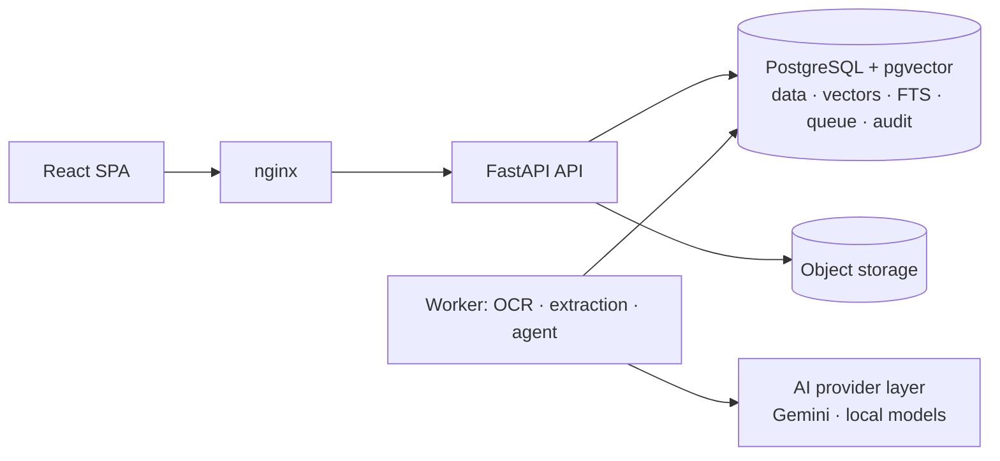

# Enterprise Document Intelligence Platform

Multimodal AI for document understanding, verification, RAG, agentic reasoning and
human-in-the-loop workflow automation — built as a compact, enterprise-grade platform rather
than an OCR demo or LLM wrapper.

> **Status: Phase 8 complete — ingestion, OCR, layout, tables, classification, structured
> extraction with evidence, document comparison, business rules, duplicate detection, the
> review queue, contract version comparison, the knowledge base with cited RAG, document
> search, the investigation agent (LangGraph, controlled tools, MCP server), and workflows
> with human approval, maker-checker, reproducible reports, the audit API and user
> administration.** The dashboard, refresh tokens, the evaluation harness and production
> deployment are designed (see [`docs/`](docs/README.md)) and are implemented in Phases 9–11.
> Nothing below claims a capability that has not been built and tested.

## What the platform will do

Upload invoices, purchase orders, contracts, receipts, delivery notes, policies and forms →
classify → extract schema-validated fields with page-level evidence → normalize → compare
documents with deterministic rules → retrieve company policy with cited RAG → let an agent
investigate discrepancies with controlled tools → route recommendations to human approval →
record everything in an append-only audit trail.



Key design decisions (full list in the [decision log](docs/architecture/13-decision-log.md)):
deterministic facts always override AI output; confidence comes from measured signals, never
LLM self-assessment; the agent can only *propose* high-impact actions; PostgreSQL is the
single stateful service (no Redis, no external vector DB); every AI provider sits behind an
interface; sensitive documents are never sent to free-tier external AI.

## What works today (Phases 0–8, verified by tests)

| Area | Implemented |
|---|---|
| Backend foundation | FastAPI app factory, typed settings with environment-aware secret validation, structured JSON logging with secret redaction, request IDs, security headers, RFC 9457 error responses (no internals leak, even on crashes) |
| Health | `/health` liveness, `/health/ready` checks database reachability **and** that the schema is at the migration head of the running build |
| Database | SQLAlchemy 2 (async, psycopg 3) + Alembic; `vector` extension; identity and audit tables; audit log is **append-only at the database level** (trigger rejects UPDATE/DELETE/TRUNCATE); migration round-trip and model/migration drift are tested |
| Auth & RBAC | argon2id passwords, JWT with strict claim validation, uniform login errors + timing equalization (no account enumeration), DB-backed lockout, roles re-read on every request, code-defined permission matrix, audited authorization denials |
| AI provider layer | `LLMProvider` / `EmbeddingProvider` interfaces, Gemini implementations on `google-genai` 2.x with structured output validation, malformed-JSON handling, error taxonomy, retries, client-side rate limiting, 768-d normalized embeddings — tested through the real SDK with HTTP mocked at the transport |
| Document upload | `POST /api/v1/documents` for PDF, PNG, JPEG and TIFF. Type taken from the file content and required to match the extension and declared type; corrupt, password-protected, oversized, too-many-pages and decompression-bomb files rejected before storage; filenames sanitized; exact duplicates flagged; file, version, job and audit row created atomically |
| Document access | List with filters and pagination, detail, download (attachment, `nosniff`, sandbox CSP), soft delete, reprocess. Department-scoped access as SQL predicates, so documents outside your scope return 404 |
| Storage | `DocumentStorage` interface with local filesystem (path confinement, atomic writes) and S3-compatible (AWS S3, R2, MinIO) backends |
| Job queue & worker | PostgreSQL queue (`SKIP LOCKED`, leases + heartbeats, retries with backoff, `LISTEN/NOTIFY` wake-up); worker re-verifies the file's SHA-256 and inspects every page: native text vs. needs OCR, size, rotation, images. Crash recovery and lease ownership are tested |
| Text extraction & OCR | Per page: the PDF text layer (word boxes in the displayed orientation) or Tesseract 5 OCR with upscaling of low-DPI images, projection-profile deskew, orientation correction, token clean-up; page preview images |
| Layout & tables | Lines, column segments, reading-order blocks, label/value grids; geometry-based tables for native and scanned pages, stitched across pages |
| Classification | Nine document types: local calibrated TF-IDF + logistic-regression model (trained at worker start from a synthetic corpus plus human corrections), LLM fallback with agreement-based confidence, human correction that later processing never overrides |
| AI safety gate | Content findings (card numbers, SSNs) and type minimums raise the effective sensitivity; above `AI_EXTERNAL_MAX_SENSITIVITY` no text reaches an external model (a self-hosted Ollama model is allowed: content stays in the deployment); uncertain or unreadable documents go to review with a reason |
| Structured extraction | Versioned schemas for invoices, purchase orders, receipts, delivery notes, contracts, resumes, bank statements and policies. A layout extractor (labels, letterhead, table columns) runs on every document; Gemini or a local Ollama model is consulted only when it is not confident, with schema-constrained output, one repair round-trip and caching. Every value carries page, quote and box and is verified against the page; values are normalized (Decimal amounts, ISO currency, explicit date-order rules, payment terms, vendor resolved against a vendor master by tax ID, alias or fuzzy name) and checked for consistency (line arithmetic, totals, tax, due date, balances) |
| Confidence & review | Field confidence from measured factors (evidence, normalization, OCR, rule strength, agreement, consistency), never model self-assessment; documents are auto-accepted, sent to analyst review or to mandatory review with reasons; a value only the model read is never auto-accepted on its own; reviewers correct values as printed, corrections are re-scored, survive reprocessing and are audited without values |
| Comparison (Phase 5) | Every processed invoice is matched with the purchase order it references and that order's delivery notes (two- and three-way match; delivered quantities summed over notes), every delivery note with its order — within the department, whatever the arrival order. Lines pair by item code, then by description. Each check is MATCH, MISMATCH, MISSING or UNCERTAIN with the difference, the tolerance and both documents' evidence (page, quote, box); a difference that rests on a weak reading or a misread item code is UNCERTAIN, not a discrepancy. Users can also compare documents of their choice |
| Business rules | 19 deterministic rules (prices, quantities ordered and delivered, lines not ordered, vendor, currency, tax rate, payment terms, missing or unknown order, arithmetic, mandatory fields, unknown vendor, delivery notes, contract expiry, payment-terms policy) with typed, validated parameters; tolerances live in the rules; administrators change parameters, severity or on/off (versioned, audited) and re-evaluate documents |
| Duplicates | Byte-identical files at upload; the same vendor and number (strong) or vendor, amount and a date within 7 days (possible) at matching; only older documents count as originals |
| Review queue | One task per document with every reason (processing, rule, duplicate), priority from severity, SLA due dates, claim/release, resolve as approved, corrected or rejected (with a note); accepted findings do not come back for that version, new ones do; tasks close by themselves when the findings disappear (e.g. the missing order arrives) |
| Contract versions | Upload a new version of a document; clause-by-clause comparison of any two processed versions (added, removed, modified with word-level changes; renumbering is not a change) |
| Knowledge base (Phase 6) | Policies, procedures, contract guidelines, FAQs, compliance and public references as Markdown, text, PDF or images, with front-matter or form metadata; organization-wide or one department; section-aware chunks with a title/breadcrumb prefix; versions by `document_key` — the newer one becomes ACTIVE, the older is cited only for dates when it was in force; archive restores the previous version; eleven synthetic seed documents (`make seed-knowledge`) |
| Hybrid RAG with citations (Phase 6) | pgvector HNSW (cosine) + weighted PostgreSQL full text fused with Reciprocal Rank Fusion; access, version window and category filters inside both scans; an evidence gate that answers "insufficient evidence" without a model call; answers composed only from claims whose citations name provided sources and whose numbers and words occur in them; sources above the external sensitivity limit never sent to the model; every query audited with a fingerprint of the question |
| Embeddings (Phase 6) | Gemini (behind the sensitivity gate), local fastembed (optional) or an offline lexical hashing model; vectors tagged with their model, full-text fallback when none, `make reembed` after switching |
| Investigation agent (Phase 7) | LangGraph graph with explicit state: understand the request → identify documents (named, or found from the question with exact document numbers) → inspect extraction and evidence → run the rules (a dry run) → compare documents on request → retrieve the policies that apply → findings with evidence labels → confidence from the weakest inputs → one allowlisted recommendation → request a human review or propose the action for approval. Runs in the worker with tool, model and time budgets; fully deterministic without a model; with Gemini or Ollama the model only plans (typed) and writes findings that must cite existing evidence and cannot clear a failed rule; guardrails overrule its proposals |
| Controlled tools (Phases 7–8) | search_documents, get_document, get_extracted_fields, get_document_evidence, search_knowledge_base, compare_documents, run_business_rules, create_review_task, generate_report, get_workflow_status — typed inputs and outputs, a permission each, run as the requesting user through the REST services' access checks, every call logged; no shell, file, network or SQL tool |
| MCP server (Phase 7) | `docintel mcp` (stdio or streamable HTTP) serves the same tools to MCP clients with personal API tokens (hashed, scoped, expiring, revocable, re-checked on every call); calls audited |
| Workflows (Phase 8) | Invoice processing and contract review as code-defined, versioned step lists run by the worker: check the document → (compare with the previous contract version) → investigate with the agent → propose one action → human approval → execute → report. Contract review checks the Contract Management Guidelines (required clauses, notice of at most 90 days, Ohio law, expiry). Start from the document page, the API, or automatically after processing (`WORKFLOW_AUTO_START`) |
| Human approval (Phase 8) | Actions PROPOSED → AWAITING_APPROVAL → APPROVED / REJECTED → EXECUTED / FAILED with a risk table (payment, duplicate rejection and contract approval for a manager; vendor clarification for a reviewer; holds and legal reviews at once); **maker-checker** — whoever started the workflow, owns the document or uploaded the version cannot decide it, enforced by the service and a database constraint; rejections need a reason and return the document to the review queue; executors re-check the current data and only record decisions (no external system is connected); append-only transition history, every change audited |
| Reports (Phase 8) | Invoice verification, contract review, compliance, document comparison and AI analysis reports: a data snapshot, Markdown rendered from it and its SHA-256; regenerating unchanged data gives the same hash, `verify` re-renders it; Markdown/JSON downloads audited; visible only to readers of all its documents |
| Audit and users (Phase 8) | `GET /audit-logs` with filters and paging (administrators everything, managers their department); user and department administration with lock-out guards (no self-demotion or self-deactivation, last administrator kept), token revocation on deactivation, password policy |
| Document search (Phase 6) | Natural-language search over business documents: types, vendor (vendor master or printed name), payment terms ("longer than 60 days", also read from text when not extracted), totals and dates become SQL filters on the current extraction; the rest is hybrid text search with snippets; the interpretation is shown |
| LLM accounting | Every call recorded in `llm_calls` (tokens, latency, status, purpose, never content), daily request budget, cost estimates from operator-configured prices, `make llm-usage` |
| Synthetic data | Seeded generator for linked purchase orders, delivery notes and invoices (12 scenarios, incl. price/quantity/tax/vendor defects, duplicates, multi-page and scanned documents) with JSON ground truth; `make process` ingests a dataset through the API |
| CLI | `docintel seed` (users and vendor master), `create-user`, `check-ai` (real end-to-end verification of the Gemini key or Ollama models), `check-ocr`, `llm-usage`, `worker`, `worker-health`, `generate-documents`, `ingest`, `knowledge-ingest`, `reembed`, `match` (re-run matching for every processed document), `mcp`, `evaluate` |
| Frontend | React 19 + TypeScript + Tailwind 4: login, protected routes, session expiry, documents inbox with upload, type/status filters, vendor column and paging, document detail with review reasons, classification evidence and correction, extracted fields with evidence, confidence, competing readings, line items, consistency checks and field correction, "show on page" highlight in the page viewer (preview, word boxes, text), tables, processing timings, download, reprocess, delete; review queue (filters, claim, priority, due dates), each document's checks, comparisons, duplicates and review decision, comparison view whose evidence links open the source field on its page, business rules (read-only, or editable with validation for administrators), versions with upload and clause comparison; knowledge page (ask with cited answers, library, upload, document passages, archive); document search with the query's interpretation; AI analysis (start an investigation or Investigate from a document; findings with evidence, policy sources, confidence factors, recommendation and the action taken or proposed, steps and tool calls); workflows (awaiting my decision, steps, proposal with its investigation, why you cannot decide, approve or reject with a reason, history) with a badge for decisions waiting; reports (content, verify, downloads, generate from a document, comparison or investigation); audit log; user administration; API tokens; system status page |
| Delivery | Non-root multi-stage images, docker compose (db, migrate, api, worker, web) with health-checked startup ordering, nginx with strict CSP, smoke test incl. a processed upload, GitHub Actions CI (lint, types, migrations, tests, quick evaluation incl. retrieval, dependency audits, secret scan, container smoke test, synthetic dataset and knowledge base loaded through the stack) |

Test suites: 778 backend tests (unit, integration against real PostgreSQL, security) and 62
frontend tests.

## Quick start

Prerequisites: Docker, [uv](https://docs.astral.sh/uv/), Node.js 22, make, and Tesseract 5 for
running the worker or tests on the host (`apt install tesseract-ocr` / `brew install tesseract`;
the Docker image includes it).

```bash
make env        # .env with a generated JWT secret
# edit .env: SEED_USER_PASSWORD (12+ chars) and GEMINI_API_KEY (https://aistudio.google.com/apikey)
make setup      # install dependencies
make seed       # Postgres in Docker + migrations + demo users + demo vendor master
make dev        # API :8000 + worker + UI http://localhost:5173
```

Or the production-like stack: `make up && make seed-docker && make smoke` → http://localhost:8080.

Try it with synthetic documents: `make generate-documents && make process`
(add `API_URL=http://localhost:8080` for the Docker stack), then open the Documents page.
Load the policy knowledge base with `make seed-knowledge` and ask on the Knowledge page.

Verify your Gemini key: `make check-ai`. The key is optional: without it, classification and
extraction run on local models and rules and send uncertain documents to review. **Free-tier
note:** Google's unpaid-tier terms allow prompts to be used for product improvement and human
review — use synthetic documents only, or a local Ollama model (`LLM_PROVIDER=ollama`).
Details: [local setup](docs/development/local-setup.md) · [configuration](docs/development/configuration.md).

## Evaluation

All numbers below come from `make evaluate`, run on a clean checkout: OCR, classification,
tables and extraction at commit `a22f1b8`, discrepancies at `fa1fcce` (re-run after two
matching fixes the other suites do not use), retrieval and search at `42fedf9`, versions at
`5bf2855` (re-run after the contract generator changed), the agent and the workflows at
`169718e` (deterministic mode; development and held-out datasets).
Retrieval was measured with the offline **lexical** hashing embeddings, and its gate thresholds
and full-text order were chosen on `kb-queries`; the holdout set is small (14 questions). They are measured on **synthetic data only**. Synthetic layouts are regular and the classifier's training and
test generators are related, so these numbers overstate real-world accuracy. Each report
lists its datasets, seeds, engine versions and caveats.

| Metric | Value | Report |
|---|---|---|
| OCR CER / WER, clean 300 DPI page | 1.2% / 1.5% (35 pages) | [ocr](evaluation/reports/ocr.md) |
| OCR CER / WER, light scan, 150 DPI | 2.3% / 3.2% | [ocr](evaluation/reports/ocr.md) |
| OCR CER / WER, heavy scan, 150 DPI | 10.4% / 14.9% | [ocr](evaluation/reports/ocr.md) |
| OCR CER / WER, 3° skew / 90° rotation | 2.0% / 3.2% · 2.7% / 3.5% | [ocr](evaluation/reports/ocr.md) |
| Classification accuracy / macro-F1, rendered native + scanned PDFs | 100% / 1.000 (n = 90) | [classification](evaluation/reports/classification.md) |
| Classification accuracy, first 300 characters only | 99.7% (n = 900); 0.0% error in the auto-accepted bucket | [classification](evaluation/reports/classification.md) |
| Classification LLM fallback | Not yet measured (needs a Gemini key) | |
| Line-item tables, native PDFs: rows exact / cell accuracy | 100% / 100% (70 documents) | [tables](evaluation/reports/tables.md) |
| Line-item tables, scanned at 150 DPI: row recall / cell accuracy | 0.894 / 83.8% (70 documents) | [tables](evaluation/reports/tables.md) |
| Field extraction, native PDFs: exact / normalized match / F1 | 100% / 100% / 1.000 (70 documents) | [extraction](evaluation/reports/extraction.md) |
| Field extraction, scanned at 150 DPI: exact / normalized match / F1 | 95.9% / 99.3% / 0.996 (70 documents) | [extraction](evaluation/reports/extraction.md) |
| Extracted line items, scanned: row recall / cell accuracy | 0.738 / 78.1% (rows paired by SKU, values normalized) | [extraction](evaluation/reports/extraction.md) |
| Auto-accepted documents / error rate inside that bucket, native | 97.1% / 0.0% (68 of 70; the other two are the invoices with a wrong printed total) | [extraction](evaluation/reports/extraction.md) |
| Auto-accepted documents, scanned | 0% — every scanned document goes to review (47 analyst, 23 mandatory) | [extraction](evaluation/reports/extraction.md) |
| Printed arithmetic errors flagged / correct documents flagged after a misread | 4 of 4 / 1.4% (2 of 140) | [extraction](evaluation/reports/extraction.md) |
| Field extraction with the LLM (Gemini or Ollama) | Not yet measured (needs a key or a local model) | |
| Discrepancy detection, dataset as generated (native PDFs + its 8 scans): precision / recall of confirmed failures | 100% / 100% (36 planted findings in 148 documents, 8 defect types); no defect-free document fails a rule, 1.7% get a warning (2 scans) | [discrepancies](evaluation/reports/discrepancies.md) |
| Discrepancy detection, scanned at 150 DPI: precision / recall | FAIL 80.0% / 77.8%; FAIL or "could not be verified" 45.3% / 94.4% | [discrepancies](evaluation/reports/discrepancies.md) |
| Defect-free documents raising a rule alarm, scanned | 4.3% FAIL, 16.4% FAIL or warning (98.3% are in review anyway for extraction uncertainty) | [discrepancies](evaluation/reports/discrepancies.md) |
| Resent invoices (different layout and date format) found as duplicates | 4 of 4, no wrong pair, native and scanned | [discrepancies](evaluation/reports/discrepancies.md) |
| Contract version changes (added / removed / modified clauses) | 40 of 40 version steps exactly right, native and scanned (20 contract families) | [versions](evaluation/reports/versions.md) |
| Knowledge retrieval, hybrid: hit@1 / hit@5 / MRR / nDCG@5 | kb-queries (tuning set, 48 answerable): 87.5% / 100% / 0.938 / 0.920 · holdout (10): 90.0% / 100% / 0.950 / 0.961 — offline lexical hashing embeddings | [retrieval](evaluation/reports/retrieval.md) |
| Retrieval ablations (kb-queries MRR) | full text only 0.918, dense only (hashing) 0.885, no title/breadcrumb prefix 0.812, fixed-size chunks 0.841 | [retrieval](evaluation/reports/retrieval.md) |
| Evidence gate: unanswerable refused / answerable refused | kb-queries 5 of 6 / 1 of 48 (thresholds chosen here) · holdout 2 of 4 / 0 of 10 | [retrieval](evaluation/reports/retrieval.md) |
| Other departments' passages returned / superseded passages cited (as of 2026-10-01) | 0 (68 questions as a Finance user) / 0 | [retrieval](evaluation/reports/retrieval.md) |
| Retrieval latency p50 / p95 (local PostgreSQL, hashing embeddings, 85 passages) | 18 ms / 25 ms | [retrieval](evaluation/reports/retrieval.md) |
| Retrieval with Gemini or fastembed embeddings | Not yet measured (no key or model download in the build environment) | |
| Generated answers: citation precision/recall, unsupported claims | Not yet measured (needs an LLM) | |
| Document search, structured questions (vendor, payment terms, totals, dates, types): precision / recall | 100% / 100% (26 questions, native synthetic PDFs, questions generated from ground truth) | [search](evaluation/reports/search.md) |
| Document search, free text: recall@10 / precision@10 | 100% / 52.5% (6 line-item queries) | [search](evaluation/reports/search.md) |
| Agent task success: invoice named / found from the question / policy question | 100% / 100% / 100% (development, 70 runs) · 100% / 100% held-out (seed 11, 60 runs, run only after development) — deterministic mode | [agent](evaluation/reports/agent.md) |
| Agent: unsafe recommendations (payment of a defective invoice) / planted defect reported / false failures on clean invoices | 0 / 100% / 0 on both datasets | [agent](evaluation/reports/agent.md) |
| Agent tool selection precision / recall; findings whose evidence exists | 99.3% / 100% (held-out 99.2% / 100%); 236 of 236 (206 of 206) | [agent](evaluation/reports/agent.md) |
| Agent: governing policy among the sources (defective invoices) | 85.7% — on both datasets the vendor-mismatch invoices miss the vendor section with the lexical embeddings | [agent](evaluation/reports/agent.md) |
| Agent guardrails vs a scripted adversarial model (16 defective invoices per dataset) | 0 payment recommendations accepted, 0 adversarial statements or summaries kept | [agent](evaluation/reports/agent.md) |
| Agent with an LLM (Gemini or Ollama planning and analysis) | Not yet measured (no key or local model in the build environment) | |
| Workflows: final proposal as expected — invoice processing / contract review | 100% of 22 + 22 invoices (development seed 7, held-out seed 11) / 100% of 36 contract versions (12 families × 3, seed 73) — deterministic mode | [workflow](evaluation/reports/workflow.md) |
| Workflows: unsafe proposals (approval where the ground truth says stop) | 0 | [workflow](evaluation/reports/workflow.md) |
| Maker-checker: attempts by a maker or a too-junior role refused / bypasses | 120 of 120 (through the service and by direct table writes) / 0; every refusal audited | [workflow](evaluation/reports/workflow.md) |
| Action state changes with an audit event | 276 of 276 | [workflow](evaluation/reports/workflow.md) |
| Reports: re-render to the stored hash / regenerated from unchanged data with the same SHA-256 | 100% / 100% of finished workflows | [workflow](evaluation/reports/workflow.md) |
| Contract guideline rules (required clauses, notice period, governing law, expiry) as expected | 144 of 144 rule outcomes; version comparison step exactly right on 24 of 24 steps | [workflow](evaluation/reports/workflow.md) |
| Workflow proposals with an LLM | Not yet measured (no key or local model in the build environment) | |
| Latency / throughput / cost per document | Not yet measured | |

Preprocessing choices were made by ablation, which is also in the OCR report. Without
upscaling, a 100 DPI page goes to 7.1% CER and 18.7% WER. Without deskew, a 3° page goes to
3.7% CER and 9.8% WER. Removing ruling lines made results worse, so it is off by default.
Scanned tables are the weakest area today, and the dataset's own four scanned documents
have too few rows to be meaningful (see the tables report). Extraction routing is deliberately
conservative on scans: header fields are 99.3% right, but line-item cells are not reliable
enough to auto-accept, so a person checks every scanned document. The layout extractor's label
vocabulary was written with the synthetic templates visible, so these numbers measure the
pipeline, not generalization to unseen layouts.
Matching is deterministic, so on native documents it finds exactly the planted defects; on scans
the 7 remaining false FAILs come from values OCR misread with high confidence (an amount
without its decimals, a quantity of 1 for 100), table rows lost from long or scanned tables
and a date it did not find; planted defects that only warn there involve a value or item code
read with low confidence, which is what a warning means. A warning still puts the document in
the review queue. The synthetic generator plants one defect per bundle in a fixed
set of layouts, so these numbers say the rules and their wiring are right, not how often real
suppliers' documents trip them.
The agent suite investigates every synthetic invoice twice through the job queue — named, and
found from a question with its number and vendor — plus held-out policy questions, and runs a
scripted adversary that always proposes payment against every defective invoice. Its
development dataset drove three fixes (identification by document number, the keyword planner
and a guardrail); the held-out dataset was generated with another seed and run only afterwards.
These numbers measure the graph, tools, rules and guardrails in deterministic mode; an LLM's
planning and analysis are not measured yet.
The workflow suite runs every synthetic invoice and every version of 12 synthetic contracts
through a workflow started by one manager and decided by another, and tries to get each
pending proposal decided by its makers and by a too-junior role, through the service and by
writing to the table directly. Its contract dataset comes from a generator that records the
clauses, notice period and governing law it wrote; the documents come from the templates the
extractors were built on, so these numbers show that the workflows and their controls work as
designed, not accuracy on real documents.
See the [evaluation plan](docs/architecture/10-evaluation-plan.md).

## Roadmap

| Phase | Scope | Status |
|---|---|---|
| 0 | Architecture & foundation (includes the master prompt's Phase 1) | **Complete** |
| 2 | Document ingestion: upload validation, storage abstraction, Postgres job queue, worker, synthetic generator | **Complete** |
| 3 | OCR & understanding: native text + Tesseract OCR on the pages that need it, layout, tables, classification, sensitivity gate | **Complete** |
| 4 | Structured extraction: schemas, evidence verification, normalization, vendor master, consistency checks, confidence routing, corrections, LLM accounting, Ollama provider, vision for low-confidence pages | **Complete** |
| 5 | Comparison & rule engine, duplicates, review queue, contract version comparison | **Complete** |
| 6 | Knowledge base & hybrid RAG with citations, document search | **Complete** |
| 7 | LangGraph agent, controlled tools, MCP server | **Complete** |
| 8 | Workflows, human approval, reports, audit API, user administration | **Complete** |
| 9 | Full enterprise UI | Next |
| 10 | Evaluation harness & reproducible demo | Planned |
| 11 | Productionization & deployment | Planned |

## Repository layout

```
backend/     Python package `docintel` (API, worker, agent, MCP server, CLI), tests
synthetic_data/  generated datasets (git-ignored output of `make generate-documents`)
frontend/    React SPA + nginx image
docs/        architecture, decisions, development guides
scripts/     smoke test and helper scripts
.github/     CI
```

## License

[MIT](LICENSE)
