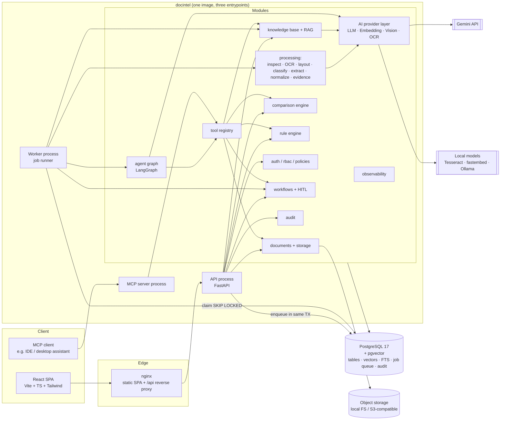

# 02 — System Architecture & Component Responsibilities

## 1. Architectural style

**Modular monolith + dedicated worker processes**, all backed by PostgreSQL.

* One Python package (`docintel`) with strict internal module boundaries.
* Three process types built from **one** container image:
  * `api` — FastAPI (HTTP, auth, validation, reads, enqueue).
  * `worker` — background pipeline: OCR, extraction, embeddings, agent runs, reports.
  * `mcp` — Model Context Protocol server exposing the controlled tools (`docintel mcp`,
    stdio or streamable HTTP; run on demand, not a compose service — Phase 7).
* PostgreSQL 17 + pgvector 0.8 is the system of record, vector store, full-text
  index, job queue and audit store.
* React SPA served by nginx, which also reverse-proxies `/api` (same origin → no
  CORS in production, cookies usable later).

**Why not microservices?** One team, one domain model, strong transactional needs
(document + job + audit written atomically). Microservices would add network
failure modes, distributed transactions and deployment cost without a scaling
benefit at this size. Module boundaries keep a later split possible (ADR-001).

## 2. Component diagram



## 3. Component responsibilities

| Component | Responsibility | Does NOT do |
|---|---|---|
| **nginx (web)** | Serve built SPA, reverse-proxy `/api`, security headers, upload size cap at the edge | Business logic, auth decisions |
| **API process** | AuthN/AuthZ, request validation, read models, enqueueing jobs, HITL decisions, OpenAPI | Heavy CPU (OCR), long LLM calls |
| **Worker process** | Claims jobs, runs idempotent pipeline stages, agent runs, embeddings, reports; heartbeats leases; retries with backoff | Serving HTTP |
| **MCP server** | Exposes allowlisted tools to MCP clients, authenticating with per-user API tokens | Anything the REST API wouldn't allow the same user |
| `core` | Settings, logging (with secret redaction), error model, security primitives (hashing, JWT) | Domain logic |
| `db` | Engine/session lifecycle, declarative models, migrations (Alembic) | Business rules |
| `auth` | Login, lockout, token issue/verify, role→permission map, document-access policy | UI concerns |
| `audit` | Append-only audit records (DB trigger forbids UPDATE/DELETE) | Storing document content |
| `documents` + `storage` | Upload validation, checksums, versions, `DocumentStorage` (Local/S3), downloads | Parsing content |
| `processing` | Page inspection, native text, OCR, layout, tables, classification, extraction, evidence verification, normalization, confidence | Decisions about business outcomes |
| `comparison` | Field/line-item/clause comparison with tolerances → `MATCH/MISMATCH/MISSING/UNCERTAIN` | Using LLMs to decide matches |
| `rules` | Deterministic, configurable rules (params in DB, evaluators in code; **no `eval`**) | Free-form expressions |
| `knowledge` | KB ingestion, structure-aware chunking, embeddings, hybrid retrieval, context assembly, citation validation | Answering without sources |
| `agent` | LangGraph investigation graph, planner, bounded tool execution, structured findings | Executing high-impact actions |
| `tools` | Typed tool registry: schemas, permission checks, timeouts, audit, output truncation | Shell/OS/network access |
| `workflows` | Invoice Processing / Contract Review definitions, HITL state machine, allowlisted action executors, review queue | Bypassing approvals |
| `ai` | `LLMProvider`, `EmbeddingProvider`, `VisionProvider`, `OCRProvider` interfaces + Gemini/local implementations, rate limiting, retries, usage accounting, sensitivity routing | Prompt business logic |
| `evaluation` | Datasets, metric computation, reports generated only from real runs | Hand-written numbers |
| `synthetic` | Generates PDFs/images with controlled defects + ground-truth JSON | Production data |

## 4. Layering rules (enforced in code review; `import-linter` contract added in Phase 11)

```
api / workers / mcp_server   (entrypoints: transport only)
        ↓
workflows · agent · tools     (orchestration)
        ↓
documents · processing · comparison · rules · knowledge · audit · auth   (domain services)
        ↓
ai · storage · db · core      (infrastructure + primitives)
```

* Entrypoints never touch the ORM directly for business operations; they call services.
* Domain services never import entrypoints.
* `ai` providers never import domain modules (prompts live with their domain).

## 5. Runtime topology per environment

| Env | Topology | Storage | AI |
|---|---|---|---|
| `local` | `make dev`: Postgres in Docker; API (`uvicorn --reload`) + Vite on host. Or `make up`: everything in Docker | Local FS volume | Gemini (synthetic data only) |
| `test` | CI: Postgres service container; providers mocked at HTTP transport level | tmp dir | none (mocked) |
| `staging` | Single VM, `docker compose` (prod images), Caddy/nginx TLS | S3-compatible bucket | Gemini paid tier or local |
| `production` | Same images; managed Postgres (pgvector) or VM Postgres with backups; ≥2 worker replicas | S3-compatible bucket, encryption at rest | Paid tier / local per sensitivity policy |

Cloud-specific code stays behind `DocumentStorage` and provider interfaces
(Module 33). Deployment is documented in Phase 11 and **not claimed until done**.

## 6. Repository structure

```
.
├── backend/                     # Python package `docintel` (API, worker, MCP entrypoints)
│   ├── pyproject.toml / uv.lock # dependencies (uv), ruff, mypy, pytest config
│   ├── Dockerfile               # one image, three entrypoints
│   ├── alembic.ini              # points at the package-internal migrations
│   ├── src/docintel/
│   │   ├── core/                # config, logging, errors, request context
│   │   ├── db/                  # engine, session, base, models/, migrations/ (Alembic)
│   │   ├── api/                 # app factory, middleware, deps, routers/, schemas/
│   │   ├── auth/                # login service, RBAC permissions, access policies
│   │   ├── audit/               # audit service
│   │   ├── ai/                  # provider interfaces + gemini/local implementations
│   │   ├── documents/  storage/  processing/  comparison/  rules/      (Phases 2–5)
│   │   ├── knowledge/  agent/  tools/  workflows/  mcp_server/          (Phases 6–8)
│   │   ├── workers/  evaluation/  synthetic/                            (Phases 2,10)
│   │   └── cli.py               # management commands (seed, create-user, check-ai)
│   └── tests/                   # unit/ integration/ security/
├── frontend/                    # React + TS + Vite + Tailwind SPA, Dockerfile, nginx.conf
├── knowledge_base/              # seed policy sources (Phase 6)
├── synthetic_data/              # generated documents land here (git-ignored)
├── evaluation/                  # dataset manifests + generated reports (Phase 10)
├── infrastructure/              # postgres init SQL, deployment configs
├── scripts/                     # dev/demo helper scripts
├── docs/                        # this documentation
├── .github/workflows/ci.yml
├── docker-compose.yml  Makefile  .env.example  .gitignore  README.md  LICENSE
```

Deviation from the suggested layout (separate top-level `workers/ ai/ mcp/
migrations/`): see C8 in [01-requirements.md](01-requirements.md) and ADR-001.
Phase-N directories are created **when they get real code**, not as empty stubs.
