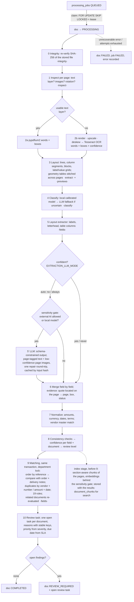
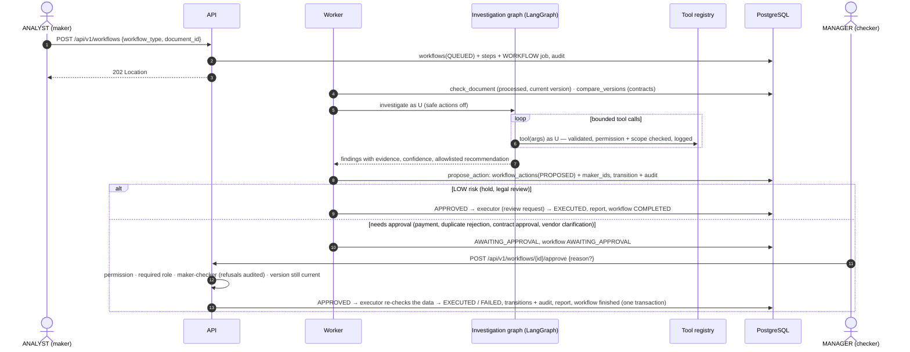

# 03 — End-to-End Data Flow

Five flows cover the system. Every step that changes state writes an audit record.

## Flow A — Upload & ingestion (API, synchronous part)

```mermaid
sequenceDiagram
  autonumber
  actor U as User (ANALYST)
  participant W as nginx
  participant A as API
  participant S as DocumentStorage
  participant DB as PostgreSQL

  U->>W: POST /api/v1/documents (multipart)
  W->>W: client_max_body_size check
  W->>A: forward
  A->>A: authenticate JWT, require documents:upload
  A->>A: stream to temp file: enforce size limit, SHA-256, sniff magic bytes
  A->>A: validate extension ∩ magic MIME ∩ allowlist; PDF: not encrypted, page limit; image: pixel limit
  A->>DB: SELECT version by sha256 (exact duplicate check, access-scoped)
  A->>S: put(key = documents/{doc_id}/v1/{uuid}.{ext})  ← never the user filename
  A->>DB: BEGIN; INSERT documents, document_versions, processing_jobs(QUEUED), audit_logs; COMMIT
  alt DB commit fails
    A->>S: delete(key)  (compensation)
  end
  A-->>U: 201 {id, status: PENDING, duplicate_of?}
```

Key properties: the job is enqueued **in the same transaction** as the document
row (no "document without job" state); the storage key is server-generated (no
path traversal); the user-supplied filename is sanitized and stored only as
display metadata.

## Flow B — Processing pipeline (worker)

Stages 0–8 are implemented (Phases 2–4); 9–11 are planned (Phases 5–6). Stage names in
brackets are the names recorded in `processing_jobs.stage_timings`.



* Every stage is **idempotent**: its results are replaced per document version, so a
  retried or re-requested job simply runs again. Human input survives: a human
  classification is never overridden, and human field corrections are re-applied to a new
  extraction of the same version and schema (ADR-032).
* Stage timings go to `processing_jobs.stage_timings` (shown on the document page) →
  dashboard "average processing time" and Prometheus histograms (Phases 9 and 11).
* Transient errors (HTTP 429/5xx, timeouts) → retry with exponential backoff and
  jitter, `run_after` pushed forward; permanent errors (validation, corrupt file)
  → fail fast.
* Lease expiry lets another worker reclaim a job whose worker crashed.

### Matching and the review queue (Phase 5)

* **When**: in the processing job's final transaction, after a field or type correction, a
  delete, `POST /rules/evaluate` and `docintel match` / `make match`. Each run takes a
  transaction-scoped advisory lock per department first, then row locks (department →
  document → review task, the same order everywhere), so two documents of one bundle
  finishing together cannot deadlock or miss each other.
* **What**: the document's facts come from its current extraction (reviewer corrections
  included). An invoice or delivery note looks up the purchase order it references (same
  department, same vendor first) and, for an invoice, the delivery notes of that order;
  the comparison records MATCH / MISMATCH / MISSING / UNCERTAIN per check with both sides'
  evidence. Duplicates: same vendor and number (strong), or same vendor, amount and a date
  within 7 days (possible), older documents only. Then the enabled rules run.
* **Related documents** — those sharing the order reference, number or amount, flagged as
  duplicates of it, or compared with it before — are re-evaluated in the same run, so the
  result does not depend on the order in which an invoice, its order and its delivery notes
  arrive.
* **Review task**: findings (processing reasons, failed or unverifiable rules, duplicates)
  become one open task per document with a reason per finding (key, message, severity),
  priority from the most severe finding and a due date from `REVIEW_SLA_HOURS`. The document
  is `REVIEW_REQUIRED` exactly while that task is open. A reviewer approves, records a
  correction or rejects (with a note); findings resolved for a version do not reopen a task,
  new ones do. When every finding disappears (e.g. the missing order arrives, a correction
  fixes a value) the task closes as `CLEARED`; a new version cancels the old version's task.

## Flow C — Knowledge ingestion & RAG query

```mermaid
sequenceDiagram
  autonumber
  actor M as MANAGER / ADMIN
  participant A as API
  participant WK as Worker
  participant E as EmbeddingProvider
  participant DB as PostgreSQL (pgvector + FTS)
  participant L as LLMProvider

  M->>A: POST /api/v1/knowledge/documents (Markdown/text/PDF/image + metadata or front matter)
  A->>A: validate, metadata, scope (org-wide or one department), version checks
  A->>DB: knowledge_documents(PROCESSING) + KNOWLEDGE_PROCESSING job + audit
  WK->>WK: integrity, parse (Markdown directly; PDFs/images via text layer/OCR + layout)
  WK->>WK: section-aware chunking (breadcrumb prefix, ~500 tokens, sentence overlap), content scan
  WK->>E: embed(chunks, RETRIEVAL_DOCUMENT) if the sensitivity gate allows (local models: always)
  WK->>DB: advisory lock on document_key → chunks replaced; ACTIVE / SUPERSEDED decided;<br/>retrieval windows copied onto chunks; audit
  Note over M,DB: --- query time ---
  M->>A: POST /api/v1/knowledge/query {question, as_of?, categories?}
  A->>E: embed(question, RETRIEVAL_QUERY) unless it holds restricted data
  A->>DB: vector top-20 ∪ full-text top-20, filtered in SQL by access, status, window ∋ as_of
  A->>A: Reciprocal Rank Fusion → evidence gate (IDF term coverage or similarity)
  alt evidence below threshold
    A-->>M: INSUFFICIENT_EVIDENCE + closest passages (no model call)
  else
    A->>A: sources S1..Sn (merged neighbours, budget); per-source sensitivity gate
    A->>L: claims[{text, citations}] from delimited, untrusted sources
    A->>A: citations ⊆ sources given; numbers + words grounded in cited text
    A-->>M: answer composed from verified claims + sources (title, version, section, period)
  end
  A->>DB: audit (question fingerprint, sources, cited, sent to model)
```

## Flow D — Workflow: investigation & human approval (as built in Phase 8)



The same investigation also runs on its own (`POST /api/v1/analysis`, Phase 7): there a
high-impact recommendation is only recorded as proposed; only a workflow turns it into an action
a person decides.

## Flow E — Final demonstration path (prompt §50)

| Step | Flow | Component |
|---|---|---|
| 1–2 Generate PO + invoice with controlled price mismatch | — | `synthetic` (`make generate-documents`) |
| 3 Upload both | A | API / storage |
| 4–7 Classify, OCR/extract, extract fields, normalize | B | worker / processing |
| 8–9 Compare, detect mismatch | B (auto-workflow) | comparison + rules |
| 10 Retrieve procurement policy | C | knowledge |
| 11–12 Agent analyzes, recommends | D | agent |
| 13–15 Human reviews, approves, workflow result | D | workflows |
| 16 Audit log records it | all | audit |
| 17 Dashboard displays it | — | SPA |

Phase 9 runs this path in a browser on every CI run: `frontend/e2e/demo.spec.ts` (`make e2e`).

## Data classification along the flow

| Data | Where it lives | Leaves the platform? |
|---|---|---|
| Original file | object storage | never |
| Page text / words / boxes | `document_pages` | to external LLM **only if** sensitivity gate allows |
| Extracted fields | `extracted_fields` | same as above |
| Prompts / completions | not stored (only token counts, model, latency, status) | n/a |
| Logs | stdout (JSON) | no document content, secrets redacted |
