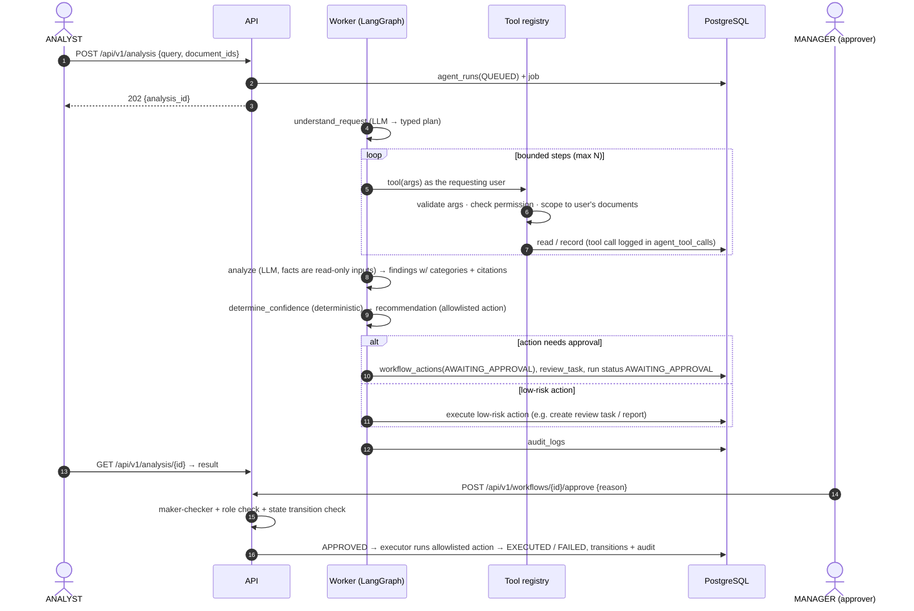

# 03 — End-to-End Data Flow

Five flows cover the system. Every step that changes state writes an audit record.

## Flow A — Upload & ingestion (API, synchronous part)

```mermaid
sequenceDiagram
  autonumber
  actor U as User (ANALYST)
  participant W as nginx
  participant A as API
  participant S as DocumentStorage
  participant DB as PostgreSQL

  U->>W: POST /api/v1/documents (multipart)
  W->>W: client_max_body_size check
  W->>A: forward
  A->>A: authenticate JWT, require documents:upload
  A->>A: stream to temp file: enforce size limit, SHA-256, sniff magic bytes
  A->>A: validate extension ∩ magic MIME ∩ allowlist; PDF: not encrypted, page limit; image: pixel limit
  A->>DB: SELECT version by sha256 (exact duplicate check, access-scoped)
  A->>S: put(key = documents/{doc_id}/v1/{uuid}.{ext})  ← never the user filename
  A->>DB: BEGIN; INSERT documents, document_versions, processing_jobs(QUEUED), audit_logs; COMMIT
  alt DB commit fails
    A->>S: delete(key)  (compensation)
  end
  A-->>U: 201 {id, status: PENDING, duplicate_of?}
```

Key properties: the job is enqueued **in the same transaction** as the document
row (no "document without job" state); the storage key is server-generated (no
path traversal); the user-supplied filename is sanitized and stored only as
display metadata.

## Flow B — Processing pipeline (worker)

```mermaid
flowchart TD
  Q[processing_jobs QUEUED] -->|claim: FOR UPDATE SKIP LOCKED + lease| P[doc → PROCESSING]
  P --> I[1 Inspect<br/>per-page: has text layer? rotation? DPI]
  I --> T{native text<br/>sufficient?}
  T -- yes --> N[2a pdfplumber words + bboxes]
  T -- no --> O[2b render page pypdfium2 → preprocess → Tesseract OCR<br/>words + bboxes + confidence]
  N & O --> L[3 Layout: lines→blocks, headings, KV candidates,<br/>tables pdfplumber / vision fallback, multi-page table stitching]
  L --> C[4 Classify: local calibrated model → LLM fallback if low]
  C --> SG{sensitivity gate:<br/>external AI allowed?}
  SG -- yes --> X[5 Extract: schema per type, LLM structured output<br/>page-tagged text (+ page images when needed)]
  SG -- no --> XL[5' local extractor / manual review task]
  X & XL --> V[6 Validate: Pydantic schema; one repair attempt with validation errors]
  V --> E[7 Evidence: locate source_text in page words → page, bbox, match score]
  E --> NM[8 Normalize: dates, currency, amounts, vendor canonicalization]
  NM --> CF[9 Confidence per field + document from measured signals]
  CF --> D[10 Duplicate detection: hash · invoice#+vendor · fuzzy amount/date · embedding similarity]
  D --> CH[11 Chunk + embed for semantic search]
  CH --> WF[12 Auto-workflow hook: e.g. invoice → find PO → comparison + rules]
  WF --> R{routing}
  R -- high confidence, no blocking rule --> DONE[doc COMPLETED]
  R -- medium/low or rule failure --> REV[doc REVIEW_REQUIRED + review_task]
  P -. unrecoverable error / attempts exhausted .-> F[doc FAILED, job FAILED, error recorded]
```

* Every stage is **idempotent** and keyed by `(document_version_id, stage)`; a
  retried job skips completed stages.
* Stage timings go to `processing_jobs.stage_timings` → dashboard "average
  processing time" and Prometheus histograms.
* Transient errors (HTTP 429/5xx, timeouts) → retry with exponential backoff and
  jitter, `run_after` pushed forward; permanent errors (validation, corrupt file)
  → fail fast.
* Lease expiry lets another worker reclaim a job whose worker crashed.

## Flow C — Knowledge ingestion & RAG query

```mermaid
sequenceDiagram
  autonumber
  actor M as MANAGER / ADMIN
  participant A as API
  participant WK as Worker
  participant E as EmbeddingProvider
  participant DB as PostgreSQL (pgvector + FTS)
  participant L as LLMProvider

  M->>A: POST /api/v1/knowledge/documents (policy PDF + metadata)
  A->>DB: knowledge_documents(PROCESSING) + job
  WK->>WK: extract text with structure (headings, sections, pages)
  WK->>WK: structure-aware chunking (section path, ~500 tokens, overlap)
  WK->>E: embed(chunks, task=RETRIEVAL_DOCUMENT) in batches
  WK->>DB: knowledge_chunks(content, tsvector, vector(768), metadata)
  Note over M,DB: --- query time ---
  M->>A: POST /api/v1/knowledge/query {question, filters}
  A->>E: embed(question, task=RETRIEVAL_QUERY)
  A->>DB: vector top-k  ∪  full-text top-k  (both pre-filtered by access, status, effective dates)
  A->>A: Reciprocal Rank Fusion → score threshold → context assembly [S1..Sn]
  alt evidence below threshold
    A-->>M: "insufficient evidence" + nearest sources (no generation)
  else
    A->>L: answer with schema {answer, claims[{text, citations}]}
    A->>A: validate citations ⊆ provided sources; drop/flag uncited claims
    A-->>M: answer + citations (doc, section, page, effective date)
  end
```

## Flow D — Agent investigation & human approval



## Flow E — Final demonstration path (prompt §50)

| Step | Flow | Component |
|---|---|---|
| 1–2 Generate PO + invoice with controlled price mismatch | — | `synthetic` (`make generate-documents`) |
| 3 Upload both | A | API / storage |
| 4–7 Classify, OCR/extract, extract fields, normalize | B | worker / processing |
| 8–9 Compare, detect mismatch | B (auto-workflow) | comparison + rules |
| 10 Retrieve procurement policy | C | knowledge |
| 11–12 Agent analyzes, recommends | D | agent |
| 13–15 Human reviews, approves, workflow result | D | workflows |
| 16 Audit log records it | all | audit |
| 17 Dashboard displays it | — | SPA |

## Data classification along the flow

| Data | Where it lives | Leaves the platform? |
|---|---|---|
| Original file | object storage | never |
| Page text / words / boxes | `document_pages` | to external LLM **only if** sensitivity gate allows |
| Extracted fields | `extracted_fields` | same as above |
| Prompts / completions | not stored (only token counts, model, latency, status) | n/a |
| Logs | stdout (JSON) | no document content, secrets redacted |
