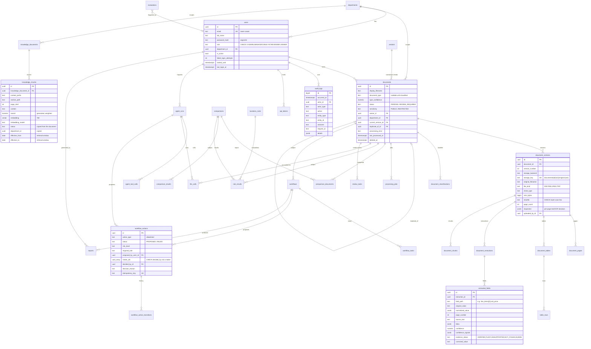

# 04 — Database Schema (PostgreSQL 17 + pgvector 0.8)

Conventions

* Primary keys: `uuid` generated by the application (UUIDv4), except `audit_logs`
  (`bigint identity`, ordered and compact).
* All timestamps are `timestamptz`; `created_at`/`updated_at` default `now()` (queue ordering columns use `clock_timestamp()`, see `processing_jobs`).
* Enumerations are `text` columns with `CHECK` constraints (not native PG enums):
  adding a value is a simple migration and never requires `ALTER TYPE` locks.
* Money is `numeric(18,4)`; never floats.
* Every foreign key has an index. Every status column used by queues/inboxes has
  a composite or partial index.
* Schema changes happen **only** through Alembic migrations; each phase adds the
  tables it needs (no speculative tables).

## 1. ER diagram

## 2. Table catalogue

### Phase 0 — identity & audit (implemented now)

| Table | Key columns / constraints | Indexes |
|---|---|---|
| `departments` | `id`, `name` UNIQUE, `created_at` | unique(name) |
| `users` | `email` UNIQUE (stored lower-case, CHECK `email = lower(email)`), `password_hash`, `role` CHECK, `department_id` FK `ON DELETE RESTRICT`, `is_active`, `failed_login_attempts ≥ 0`, `locked_until`, `last_login_at`, timestamps | unique(email), (department_id), (role) |
| `audit_logs` | `id bigint identity`, `occurred_at`, `actor_id` FK `ON DELETE SET NULL`, `actor_type` CHECK (`USER, SYSTEM, AGENT, WORKER, ANONYMOUS`), `actor_role`, `action`, `entity_type`, `entity_id`, `outcome` CHECK (`SUCCESS, FAILURE, DENIED`), `request_id`, `ip_address inet`, `user_agent`, `details jsonb` | (occurred_at DESC), (actor_id, occurred_at), (entity_type, entity_id), (action) |

`audit_logs` is **append-only at the database level**: a `BEFORE UPDATE OR DELETE`
trigger raises an exception, so even application bugs or a compromised API
process cannot rewrite history. (`TRUNCATE` is blocked by a statement trigger as
well.) Retention/archival in production is done by a separate privileged role.

The `vector` extension is created in the first migration so later phases can add
vector columns without superuser steps.

### Phase 2 — documents, storage, jobs

| Table | Purpose / notable columns |
|---|---|
Implemented by migration `0002_documents_and_jobs` (✅ Phase 2).

| Table | Purpose / notable columns |
|---|---|
| `documents` | Logical document. `status` CHECK (`PENDING, PROCESSING, COMPLETED, FAILED, REVIEW_REQUIRED`), `sensitivity` CHECK (`PUBLIC, INTERNAL, CONFIDENTIAL, RESTRICTED`), `source` CHECK (`UPLOAD, API, SYNTHETIC`), `document_type` CHECK (nullable until classification in Phase 3), `type_confidence` CHECK 0–1, `owner_id`, `department_id`, `current_version_id`, `duplicate_of_id` + `duplicate_reason`, `processing_error`, `last_processed_at`, `deleted_at` + `deleted_by_id` (soft delete). Indexes: partial `(department_id, status, created_at DESC) WHERE deleted_at IS NULL`, `(owner_id)`, `(document_type)`, `(duplicate_of_id)`. `vendor_id` was added with the `vendors` table (Phase 4). |
| `document_versions` | Immutable file version: `version_number` (unique per document), `storage_backend` CHECK (`local, s3`), `storage_key` (unique), `original_filename`, `file_kind`, `mime_type`, `size_bytes` (> 0), `sha256` (CHECK lower-case hex), `page_count` (≥ 1), `inspection jsonb` (per-page native-text/OCR decision written by the worker), `uploaded_by_id`. Index on `sha256` for exact-duplicate detection. |
| `processing_jobs` | Queue: `job_type` CHECK, `status` CHECK (`QUEUED, PROCESSING, COMPLETED, FAILED, CANCELLED`), `document_id`, `document_version_id`, `requested_by_id`, `payload jsonb`, `priority`, `attempts`, `max_attempts`, `run_after`, `locked_by`, `locked_at`, `lease_expires_at`, `last_error`, `stage`, `stage_timings jsonb`, `started_at`, `finished_at`. Partial index `(priority DESC, run_after) WHERE status = 'QUEUED'` (claim path); partial index `(lease_expires_at) WHERE status = 'PROCESSING'` (expired-lease recovery); unique partial index `(job_type, document_version_id) WHERE status IN ('QUEUED','PROCESSING')` so a version can never be queued twice. `created_at` and `run_after` default to `clock_timestamp()` (not `now()`, which is fixed per transaction) so FIFO order holds for jobs created in one transaction. |

### Phase 3 — understanding

Implemented by migration `0003_document_understanding` (✅ Phase 3). Results belong to a
document **version** and are replaced when the version is reprocessed.

| Table | Purpose / notable columns |
|---|---|
| `document_pages` | `document_version_id`, `page_number` (unique pair), `width`, `height`, `unit` CHECK (`pt`, `px`), `rotation_applied` CHECK (0/90/180/270), `extraction_method` CHECK (`NATIVE, OCR`), `ocr_confidence` (0–100), `word_count`, `text`, `words jsonb` (`[text, x0, y0, x1, y1, ocr_conf, size]`, top-left origin, page units), `layout jsonb` (lines with column segments, reading-order blocks, deskew angle, warnings), `preview_storage_key` + `preview_width`/`preview_height` (PNG in document storage). |
| `document_tables` | `document_version_id`, `table_index` (unique pair), `page_start`, `page_end` (CHECK end ≥ start), `header jsonb`, `bbox jsonb`, `extraction_method` CHECK (`NATIVE, OCR, MIXED`), `confidence` (0–1, layout heuristic), `row_count`. |
| `table_rows` | `table_id` (CASCADE), `row_index` (unique pair), `page_number`, `cells jsonb`, `bbox jsonb`. |
| `document_classifications` | History of labels: `document_id`, `document_version_id`, `label` CHECK (document types), `confidence` (0–1), `method` CHECK (`LOCAL_MODEL, LLM, ENSEMBLE, HUMAN`), `model_version` (classifier fingerprint), `signals jsonb` (local probabilities, keyword evidence, LLM use, gate decision), `note`, `created_by_id`, `is_current`; `created_at` defaults to `clock_timestamp()`. Partial unique index: one `is_current` row per document. A `HUMAN` row is never replaced by later processing; human rows are training data for the local model. |

Also added: `documents.review_reasons jsonb` (codes explaining `REVIEW_REQUIRED`) and
`document_versions.sensitivity_assessment jsonb` (content findings — counts and pages only —
type minimum and detected sensitivity, input to the external-AI gate).

### Phase 4 — extraction

Implemented by migration `0004_structured_extraction` (✅ Phase 4), which also enables the
`pg_trgm` extension. An extraction belongs to a document **version**; exactly one extraction
per document is current (partial unique index `uq_document_extractions_current WHERE
is_current`); older ones are kept as history.

| Table | Purpose / notable columns |
|---|---|
| `vendors` | Vendor master data: `canonical_name` UNIQUE, `name_key` (organization key: casefolded, legal suffixes removed; GIN trigram index), `aliases text[]` + `alias_keys text[]` (GIN), `tax_id` + `tax_id_key` (index), `default_currency` CHECK ISO 4217 pattern, `payment_terms_days` CHECK ≥ 0, `is_active`, `created_by_id` FK `RESTRICT`, timestamps. |
| `documents.vendor_id` | FK → `vendors` `ON DELETE SET NULL` (index): the vendor the current extraction matched. |
| `document_extractions` | One extraction run: `document_id` / `document_version_id` FK `CASCADE`, `schema_name`, `schema_version` CHECK ≥ 1, `status` CHECK (`SUCCEEDED, PARTIAL, FAILED`), `method` CHECK (`LOCAL, LLM, COMBINED`), `provider`, `model`, `prompt_version`, `input_hash` (partial index where `llm_output IS NOT NULL`: the LLM cache), `llm_output jsonb` (validated model output), `output jsonb` / `normalized_output jsonb` (merged result), `checks jsonb` (consistency checks), `validation_errors jsonb`, `signals jsonb` (LLM use, gate decision, normalization context), `overall_confidence` CHECK 0–1, `review_level` CHECK (`AUTO, ANALYST_REVIEW, MANDATORY_REVIEW`), `is_current`, `created_at`. Indexes `(document_id, created_at)`, `(document_version_id)`. |
| `extracted_fields` | Field-level provenance + correction, one row per scalar, table cell and list item: `extraction_id` FK `CASCADE`, `position`, `field_path` (UNIQUE per extraction, e.g. `line_items[2].quantity`), `field_name`, `group_name`, `row_index`, `value_type` CHECK (14 types), `is_required`, `original_value` (as printed), `normalized_value jsonb`, `page_number` CHECK ≥ 1, `source_text`, `bbox jsonb`, `evidence_status` CHECK (`VERIFIED, FUZZY, UNSUPPORTED, NOT_FOUND, HUMAN`), `origin` CHECK (`LOCAL, LLM, BOTH, DERIVED, HUMAN`), `method`, `confidence` CHECK 0–1, `confidence_signals jsonb`, `alternatives jsonb` (the competing reading), `corrected_value`, `corrected_normalized jsonb`, `correction_note`, `corrected_by_id` FK `RESTRICT`, `corrected_at`. |
| `llm_calls` | AI usage accounting, no prompt or output content: `created_at`, `provider`, `model`, `purpose`, `document_id` FK `SET NULL`, `prompt_version`, `status` CHECK (`SUCCEEDED, FAILED`), `error_code`, `input_tokens`, `output_tokens`, `thinking_tokens`, `latency_ms`, `estimated_cost_usd` CHECK ≥ 0 (NULL when no price is configured). Indexes `(provider, created_at)` (daily budget) and `(document_id)`. `agent_run_id` (Phase 7) attributes calls to an investigation. |

### Phase 5 — comparison, rules, review

Implemented by migration `0005_matching_rules_review` (✅ Phase 5), which also seeds the 19
default rules (ids are UUIDv5 of `docintel:rule:<CODE>`, so every installation has the same
ids) and opens a review task for every document already in `REVIEW_REQUIRED`. Contract-version
comparison is computed on request from the stored page text and not stored. Contract/policy
and resume/job comparisons need extraction ground truth for those types and are not built yet.

| Table | Purpose / notable columns |
|---|---|
| `documents` (new columns) | Key facts of the current extraction, kept in step by matching: `number_key`, `po_key` (normalized references; for a purchase order its own number), `document_date`, `total_amount numeric(18,4)`, `currency` CHECK ISO pattern, `vendor_key`. Partial indexes `(department_id, po_key)` and `(department_id, number_key)` where not deleted. |
| `comparisons` | `comparison_type` CHECK (`INVOICE_PO, INVOICE_DELIVERY, INVOICE_PO_DELIVERY, PO_DELIVERY`), `origin` CHECK (`AUTO, MANUAL`), `subject_document_id` FK `CASCADE`, `department_id` FK `RESTRICT`, `summary jsonb` (items per status), `settings jsonb` (tolerances and confidence threshold used), `requested_by_id` FK `RESTRICT`, `created_at`. Partial unique index: one `AUTO` comparison per subject (replaced on every run); index `(department_id, created_at)`. |
| `comparison_documents` | PK `(comparison_id, document_id)`; `document_version_id` and `extraction_id` (FK `SET NULL`: what exactly was compared), `role` CHECK (`INVOICE, PURCHASE_ORDER, DELIVERY_NOTE`), `position`. Supports the three-way match with several delivery notes. |
| `comparison_results` | One row per check: `position`, `item_key` (e.g. `line:BRG-6204:unit_price`), `category` CHECK (`HEADER, LINE_ITEM`), `check_name`, `line_key`, `status` CHECK (`MATCH, MISMATCH, MISSING, UNCERTAIN`), `left_value`, `right_value`, `difference jsonb` (absolute / relative), `tolerance jsonb`, `evidence jsonb` (per side: document, field id, page, quote, box, confidence, corrected), `explanation` (deterministic template). |
| `business_rules` | `code` UNIQUE (e.g. `INV_PO_UNIT_PRICE`), `rule_type` (evaluator key), `name`, `description`, `applies_to text[]`, `params jsonb` (validated by the evaluator's Pydantic model, `extra=forbid`), `severity` CHECK (`LOW, MEDIUM, HIGH, CRITICAL`), `is_enabled`, `version` CHECK ≥ 1 (+1 per change), `updated_by_id`, `updated_at`. |
| `rule_results` | Latest evaluation per document: `document_id` / `document_version_id` FK `CASCADE`, `comparison_id` FK `SET NULL` (when the finding rests on comparison items), `rule_id` FK `CASCADE`, `rule_code`, `rule_version`, `outcome` CHECK (`PASS, FAIL, WARN, ERROR, NOT_APPLICABLE`), `severity`, `message`, `evidence jsonb`, `items jsonb` (comparison item keys), `evaluated_at`. |
| `review_tasks` | Human review queue: `document_id` / `document_version_id` FK `CASCADE`, `task_type` CHECK (`DUPLICATE_REVIEW, DISCREPANCY_REVIEW, EXTRACTION_REVIEW, CLASSIFICATION_REVIEW`), `status` CHECK (`OPEN, IN_PROGRESS, RESOLVED, CANCELLED`), `priority` CHECK (`URGENT, HIGH, NORMAL, LOW`), `reasons jsonb` (key, category, code, severity, message), `reason_keys text[]` (what a human resolution acknowledges), `due_at`, `assigned_to_id`, `claimed_at`, `resolution` CHECK (`APPROVED, CORRECTED, REJECTED, CLEARED`), `resolution_note`, `resolved_by_id`, `resolved_at`. CHECKs: `resolved_at` set exactly when closed, `resolution` set exactly when resolved. Partial unique index: **one open task per document**; index `(status, priority, created_at)`. Workflows hand work to reviewers through review requests (Phase 8), so tasks carry no workflow link. |

### Phase 6 — knowledge & search

| Table | Purpose / notable columns |
|---|---|
| `knowledge_documents` (migration 0006) | One row per uploaded version. `document_key` (same key = versions of one document), `title`, `category` CHECK (`POLICY, PROCEDURE, CONTRACT_GUIDELINE, FAQ, COMPLIANCE, PUBLIC_REFERENCE`), `version_label`, `department_id` FK `RESTRICT` (NULL = organization-wide), `sensitivity` (label) and `effective_sensitivity` (label raised by content findings, set when processed), `effective_from`, `effective_to` (CHECK to ≥ from), `status` CHECK (`PROCESSING, ACTIVE, SUPERSEDED, ARCHIVED, FAILED`), `supersedes_id` FK `SET NULL`, `source_format` (`MARKDOWN, TEXT, PDF, PNG, JPEG, TIFF`), file columns (name, MIME type, size, SHA-256, storage backend + key), `page_count`, `chunk_count`, `embedding_model` / `embedding_note` (why there are no vectors), `processing_error`, `processed_at`, `uploaded_by_id`, `deleted_at` (archive = soft delete). Partial unique index: **one ACTIVE row per `document_key`**. |
| `knowledge_chunks` | `knowledge_document_id` FK `CASCADE`, `chunk_index` (unique per document), `context_prefix` (title + breadcrumb), `content`, `section_path`, `heading`, `kind` (text/table), `page_start/end`, `token_count`, `content_hash`, `search tsvector GENERATED ALWAYS AS (setweight(to_tsvector('english', context_prefix), 'A') ‖ setweight(to_tsvector('english', content), 'B')) STORED`, `embedding vector(768)` (NULL = full text only), `embedding_model`; copied from the document so filters run in the same scan: `status`, `department_id`, `category`, `sensitivity` (effective), `effective_from/to` (the version's **retrieval window**, ADR-044). HNSW `vector_cosine_ops (m=16, ef_construction=64)`, GIN on `search`, B-tree `(status, department_id)`. |
| `document_chunks` | Same chunk columns for business documents (current version only; removed when the document is deleted): `document_id`, `document_version_id` FK `CASCADE`. Access is filtered through `documents` (the same predicate as every document read). |
| `processing_jobs` (0006) | `knowledge_document_id` FK `CASCADE`; `job_type` adds `KNOWLEDGE_PROCESSING`; partial unique index: one active job per knowledge document. |

pgvector 0.8 **iterative index scans** (`SET hnsw.iterative_scan = relaxed_order`)
are enabled for filtered queries so access/metadata filters don't under-fill top-k.

### Phase 7 — agent (migration 0007, as built)

| Table | Purpose / notable columns |
|---|---|
| `agent_runs` | One investigation: `run_type` (`INVESTIGATION`), `status` CHECK (`QUEUED, RUNNING, COMPLETED, FAILED`; `finished_at` set exactly when finished), `query` (≤ 2000 chars, the requester's own text), `document_ids uuid[]`, `options jsonb` (`allow_safe_actions`), `requested_by_id` FK `RESTRICT`, `graph_version`, `plan jsonb`, `result jsonb` (summary, documents, findings with evidence labels, evidence catalogue, sources, confidence, recommendation, action, notices, model — **no reasoning**), `trace jsonb` (node, duration, tool calls), `error`, `tool_calls`, `llm_calls`, `input_tokens`, `output_tokens`, `estimated_cost_usd`, `created_at` / `started_at` / `finished_at`. Indexes `(requested_by_id, created_at)`, `(status)`. |
| `agent_tool_calls` | Every controlled tool call: `run_id` FK `CASCADE` (NULL for MCP calls; CHECK `via = 'MCP' OR run_id IS NOT NULL`), `actor_id` FK `RESTRICT`, `via` (`AGENT, MCP`), `node_name`, `tool_name`, `arguments jsonb` (validated arguments only), `result_summary jsonb` (bounded, content-free), `status` (`SUCCEEDED, FAILED, DENIED, INVALID`), `error`, `latency_ms`. Indexes `(run_id, step_index)`, `(actor_id, created_at)`. |
| `api_tokens` | Personal MCP tokens: `user_id` FK `CASCADE`, `name`, `prefix` (display), `token_hash` UNIQUE (SHA-256; the token itself is never stored), `scopes text[]`, `created_at`, `expires_at` (CHECK after creation), `last_used_at`, `revoked_at`. |
| `review_requests` | A request for human review of a document version (user or investigation): `document_id` / `document_version_id` FK `CASCADE`, `requested_by_id` FK `RESTRICT`, `agent_run_id` FK `SET NULL`, `priority` (`HIGH, NORMAL, LOW` used), `reason` (1–1000 chars). Requests are review items like rule findings: they keep the version's task open through re-evaluations until a person resolves it. |
| `review_tasks` (0007) | `task_type` adds `REQUESTED_REVIEW` (a task whose only items are requests). |
| `llm_calls` (0007) | `agent_run_id` FK `SET NULL` + index: model calls of a run are attributed to it. |
| `processing_jobs` (0007) | `agent_run_id` FK `CASCADE`, unique; `job_type` adds `AGENT_ANALYSIS`. |

### Phase 8 — workflows & HITL (migration 0008, as built)

| Table | Purpose / notable columns |
|---|---|
| `workflows` | Instance of a code-defined workflow: `workflow_type` (`INVOICE_PROCESSING, CONTRACT_REVIEW`), `definition_version` (≥ 1; definitions live in code), `status` (`QUEUED, RUNNING, AWAITING_APPROVAL, COMPLETED, REJECTED, FAILED, CANCELLED`; CHECK `finished_at` set exactly when finished), `trigger` (`MANUAL, AUTO`), `document_id` / `document_version_id` FK `CASCADE` (the version it ran on), `initiated_by_id` FK `RESTRICT`, `agent_run_id` FK `SET NULL` (its investigation), `current_step`, `outcome` (e.g. `APPROVED_FOR_PAYMENT`, `SENT_TO_LEGAL_REVIEW`), `error`, `created_at` / `started_at` / `finished_at` / `updated_at`. Partial unique index: **one active workflow of a type per document** (`QUEUED, RUNNING, AWAITING_APPROVAL`). |
| `workflow_tasks` | The steps of a workflow (`check_document`, `compare_versions`, `investigate`, `propose_action`, `approval`, `execute_action`, `report`): `sequence` (unique per workflow), `step_name`, `status` (`PENDING, RUNNING, COMPLETED, FAILED, SKIPPED`), `output jsonb`, `error`, timings. |
| `workflow_actions` | The HITL unit: `action_type` (allowlist: `APPROVE_FOR_PAYMENT, REJECT_DUPLICATE, REQUEST_VENDOR_CLARIFICATION, HOLD_FOR_REVIEW, APPROVE_CONTRACT, REQUEST_LEGAL_REVIEW`), `status` (`PROPOSED, AWAITING_APPROVAL, APPROVED, REJECTED, EXECUTED, FAILED`), `risk_level`, `requires_approval`, `required_role`, `proposed_by_type` (`RULES, AGENT, USER`), `proposed_by_user_id` (the person the workflow runs for), `agent_run_id`, `rationale` (≤ 2000), `confidence_level` / `confidence_score` (0–1), `payload jsonb`, `maker_ids uuid[]` (starter, document owner, version uploader), `decided_by_id`, `decided_at`, `decision_reason` (≤ 1000), `executed_at`, `execution_result jsonb`, `error`, `idempotency_key` UNIQUE, `document_id` / `document_version_id` (what was proposed for). CHECKs: **maker-checker** `decided_by_id IS NULL OR NOT (decided_by_id = ANY (maker_ids))`; an action needing approval is decided by a person; a rejection has a reason; `decided_at` / `executed_at` set with their states. |
| `workflow_action_transitions` | Append-only history (an `UPDATE` trigger refuses changes): `id` identity, `action_id` FK `CASCADE`, `from_status`, `to_status`, `actor_type`, `actor_id`, `reason`, `created_at`. Written in the same transaction as the status change, together with an audit event. |
| `reports` | Reproducible reports: `report_type` (`INVOICE_VERIFICATION, CONTRACT_REVIEW, DOCUMENT_COMPARISON, COMPLIANCE_REVIEW, AI_ANALYSIS`), `subject_type` (`DOCUMENT, COMPARISON, AGENT_RUN`) + `subject_id`, `title`, `document_ids uuid[]` (≥ 1; GIN index — a report is visible only to readers of all its documents), `workflow_id` FK `SET NULL`, `template_version`, `snapshot jsonb` (the data the report was rendered from), `content` (Markdown), `content_sha256` (CHECK hex), `as_of` (newest data timestamp in the snapshot), `generated_by_id`, `created_at`. |
| `processing_jobs` (0008) | `workflow_id` FK `CASCADE` + index; `job_type` adds `WORKFLOW`. |
| `business_rules` (0008) | Seeds the contract rules `CONTRACT_REQUIRED_CLAUSES`, `CONTRACT_TERMINATION_NOTICE`, `CONTRACT_GOVERNING_LAW` (an existing rule with the same code is left alone). |

### Phase 9 — browser sessions (migration 0009, as built)

| Table | Purpose / notable columns |
|---|---|
| `refresh_tokens` | One row per refresh token of a web sign-in (ADR-063): `user_id` FK `CASCADE`, `family_id` (one per sign-in; revoked together), `token_hash` UNIQUE (SHA-256; the token is never stored), `created_at`, `expires_at` (idle limit), `session_expires_at` (absolute limit; CHECK `expires_at <= session_expires_at`), `replaced_at` (rotated: presenting it again is reuse), `revoked_at` + `revoke_reason` (`logout`, `reuse_detected`, `user_deactivated`, `password_reset`; CHECK a revocation has a reason). Indexes on `user_id`, `family_id`. |

### Phase 10 — evaluation

| Table | Purpose / notable columns |
|---|---|
| `evaluations` | One evaluation report per row, copied verbatim (ADR-067): `suite` (CHECK `^[a-z][a-z_]{0,39}$`: ocr, classification, tables, extraction, discrepancies, versions, retrieval, search, agent, workflow, system), `title`, `quick` (small smoke-test datasets), `git_revision`, `run_at` (when the suite produced it), `dataset` / `config` / `environment` / `metrics` / `notes` / `tables` (JSONB as written), `report_markdown`, `report_sha256` (SHA-256 of the canonical JSON; UNIQUE with `suite`, so a report is stored once), `gates` (regression gate results when it was recorded; NULL when none applied), `source` (`RUN` — `docintel evaluate --record`, `IMPORT` — `docintel evaluation import`), `recorded_by_id` FK `SET NULL`, `recorded_at`. Index on (`suite`, `run_at`). Migration 0010. Nothing is computed here: the reports in `evaluation/reports/` stay the record. |

### Phase 11 — rate limits (migration 0011, as built)

| Table | Purpose / notable columns |
|---|---|
| `rate_limit_counters` | Request counts per key and one-minute window, shared by the API replicas (ADR-074): `key` (scope and caller, e.g. `search:<user id>`, `login:<address>`; up to 120 chars) and `window_start` form the primary key; `expires_at` (indexed: expired windows are deleted as new ones are written), `hits` (CHECK ≥ 1). **UNLOGGED**: counters are short-lived, and a crash only resets the current window. No foreign keys and no personal data beyond the key. |

## 3. Integrity rules worth calling out

* `documents.current_version_id` → `document_versions.id` closes a cycle with `document_versions.document_id`. The FK is added after both tables exist (`ON DELETE SET NULL`), and the ORM inserts the document, then the version, then sets `current_version_id` with a follow-up `UPDATE` in the same transaction (SQLAlchemy `post_update`), so no deferrable constraint is needed.
* Soft-deleted documents (`deleted_at` set) are excluded by the access-policy query helper, so every read path—including RAG and agent tools—ignores them.
* `workflow_action_transitions` rows are written by the same function that changes `workflow_actions.status` (`workflows.actions.transition`), inside the same transaction and with an audit event; invalid transitions are rejected before the write, and the table refuses updates.
* Maker-checker is enforced twice: the service refuses (and audits) a decision by a maker or by a too-junior role, and the `ck_workflow_actions_maker_checker` constraint refuses a maker's decision written by any other path.
* Vector columns store L2-normalized vectors; cosine distance (`<=>`) is used consistently.
* Extraction history: a new extraction clears `is_current` on the previous one in the same transaction; the partial unique index makes two current extractions impossible. Human corrections are copied forward onto a re-extraction of the same version and schema (ADR-032).
* Matching state is derived and rebuilt: automatic comparisons and rule results of a document are replaced on every run; review tasks are the only matching state with human input and are never deleted (closed as `RESOLVED`, `CLEARED` or `CANCELLED`). `documents.status` is `REVIEW_REQUIRED` exactly while an open review task exists (ADR-035).
