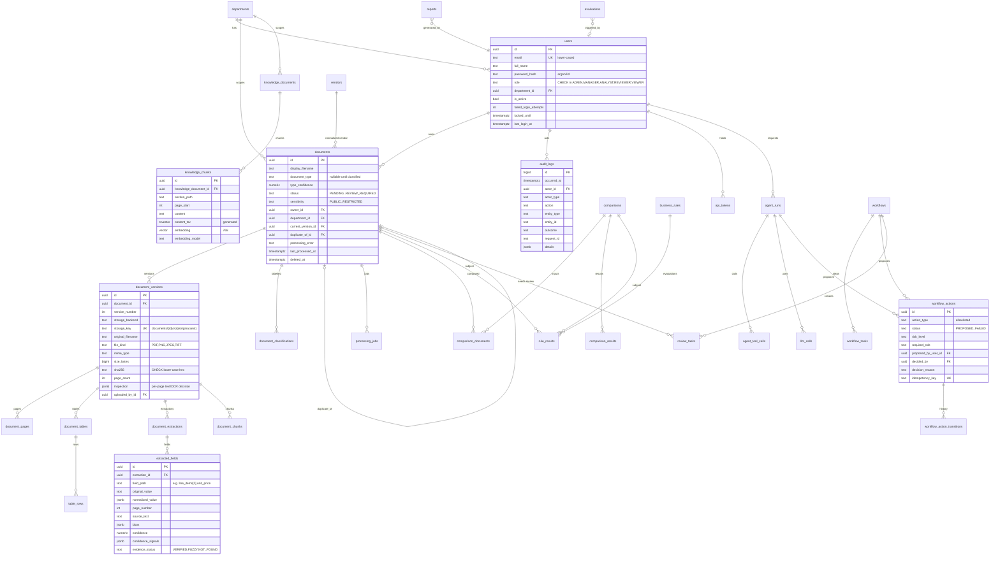

# 04 — Database Schema (PostgreSQL 17 + pgvector 0.8)

Conventions

* Primary keys: `uuid` generated by the application (UUIDv4), except `audit_logs`
  (`bigint identity`, ordered and compact).
* All timestamps are `timestamptz`; `created_at`/`updated_at` default `now()` (queue ordering columns use `clock_timestamp()`, see `processing_jobs`).
* Enumerations are `text` columns with `CHECK` constraints (not native PG enums):
  adding a value is a simple migration and never requires `ALTER TYPE` locks.
* Money is `numeric(18,4)`; never floats.
* Every foreign key has an index. Every status column used by queues/inboxes has
  a composite or partial index.
* Schema changes happen **only** through Alembic migrations; each phase adds the
  tables it needs (no speculative tables).

## 1. ER diagram

## 2. Table catalogue

### Phase 0 — identity & audit (implemented now)

| Table | Key columns / constraints | Indexes |
|---|---|---|
| `departments` | `id`, `name` UNIQUE, `created_at` | unique(name) |
| `users` | `email` UNIQUE (stored lower-case, CHECK `email = lower(email)`), `password_hash`, `role` CHECK, `department_id` FK `ON DELETE RESTRICT`, `is_active`, `failed_login_attempts ≥ 0`, `locked_until`, `last_login_at`, timestamps | unique(email), (department_id), (role) |
| `audit_logs` | `id bigint identity`, `occurred_at`, `actor_id` FK `ON DELETE SET NULL`, `actor_type` CHECK (`USER, SYSTEM, AGENT, WORKER, ANONYMOUS`), `actor_role`, `action`, `entity_type`, `entity_id`, `outcome` CHECK (`SUCCESS, FAILURE, DENIED`), `request_id`, `ip_address inet`, `user_agent`, `details jsonb` | (occurred_at DESC), (actor_id, occurred_at), (entity_type, entity_id), (action) |

`audit_logs` is **append-only at the database level**: a `BEFORE UPDATE OR DELETE`
trigger raises an exception, so even application bugs or a compromised API
process cannot rewrite history. (`TRUNCATE` is blocked by a statement trigger as
well.) Retention/archival in production is done by a separate privileged role.

The `vector` extension is created in the first migration so later phases can add
vector columns without superuser steps.

### Phase 2 — documents, storage, jobs

| Table | Purpose / notable columns |
|---|---|
Implemented by migration `0002_documents_and_jobs` (✅ Phase 2).

| Table | Purpose / notable columns |
|---|---|
| `documents` | Logical document. `status` CHECK (`PENDING, PROCESSING, COMPLETED, FAILED, REVIEW_REQUIRED`), `sensitivity` CHECK (`PUBLIC, INTERNAL, CONFIDENTIAL, RESTRICTED`), `source` CHECK (`UPLOAD, API, SYNTHETIC`), `document_type` CHECK (nullable until classification in Phase 3), `type_confidence` CHECK 0–1, `owner_id`, `department_id`, `current_version_id`, `duplicate_of_id` + `duplicate_reason`, `processing_error`, `last_processed_at`, `deleted_at` + `deleted_by_id` (soft delete). Indexes: partial `(department_id, status, created_at DESC) WHERE deleted_at IS NULL`, `(owner_id)`, `(document_type)`, `(duplicate_of_id)`. `vendor_id` arrives with the `vendors` table (Phase 4). |
| `document_versions` | Immutable file version: `version_number` (unique per document), `storage_backend` CHECK (`local, s3`), `storage_key` (unique), `original_filename`, `file_kind`, `mime_type`, `size_bytes` (> 0), `sha256` (CHECK lower-case hex), `page_count` (≥ 1), `inspection jsonb` (per-page native-text/OCR decision written by the worker), `uploaded_by_id`. Index on `sha256` for exact-duplicate detection. |
| `processing_jobs` | Queue: `job_type` CHECK, `status` CHECK (`QUEUED, PROCESSING, COMPLETED, FAILED, CANCELLED`), `document_id`, `document_version_id`, `requested_by_id`, `payload jsonb`, `priority`, `attempts`, `max_attempts`, `run_after`, `locked_by`, `locked_at`, `lease_expires_at`, `last_error`, `stage`, `stage_timings jsonb`, `started_at`, `finished_at`. Partial index `(priority DESC, run_after) WHERE status = 'QUEUED'` (claim path); partial index `(lease_expires_at) WHERE status = 'PROCESSING'` (expired-lease recovery); unique partial index `(job_type, document_version_id) WHERE status IN ('QUEUED','PROCESSING')` so a version can never be queued twice. `created_at` and `run_after` default to `clock_timestamp()` (not `now()`, which is fixed per transaction) so FIFO order holds for jobs created in one transaction. |

### Phase 3 — understanding

Implemented by migration `0003_document_understanding` (✅ Phase 3). Results belong to a
document **version** and are replaced when the version is reprocessed.

| Table | Purpose / notable columns |
|---|---|
| `document_pages` | `document_version_id`, `page_number` (unique pair), `width`, `height`, `unit` CHECK (`pt`, `px`), `rotation_applied` CHECK (0/90/180/270), `extraction_method` CHECK (`NATIVE, OCR`), `ocr_confidence` (0–100), `word_count`, `text`, `words jsonb` (`[text, x0, y0, x1, y1, ocr_conf, size]`, top-left origin, page units), `layout jsonb` (lines with column segments, reading-order blocks, deskew angle, warnings), `preview_storage_key` + `preview_width`/`preview_height` (PNG in document storage). |
| `document_tables` | `document_version_id`, `table_index` (unique pair), `page_start`, `page_end` (CHECK end ≥ start), `header jsonb`, `bbox jsonb`, `extraction_method` CHECK (`NATIVE, OCR, MIXED`), `confidence` (0–1, layout heuristic), `row_count`. |
| `table_rows` | `table_id` (CASCADE), `row_index` (unique pair), `page_number`, `cells jsonb`, `bbox jsonb`. |
| `document_classifications` | History of labels: `document_id`, `document_version_id`, `label` CHECK (document types), `confidence` (0–1), `method` CHECK (`LOCAL_MODEL, LLM, ENSEMBLE, HUMAN`), `model_version` (classifier fingerprint), `signals jsonb` (local probabilities, keyword evidence, LLM use, gate decision), `note`, `created_by_id`, `is_current`; `created_at` defaults to `clock_timestamp()`. Partial unique index: one `is_current` row per document. A `HUMAN` row is never replaced by later processing; human rows are training data for the local model. |

Also added: `documents.review_reasons jsonb` (codes explaining `REVIEW_REQUIRED`) and
`document_versions.sensitivity_assessment jsonb` (content findings — counts and pages only —
type minimum and detected sensitivity, input to the external-AI gate).

### Phase 4 — extraction

| Table | Purpose / notable columns |
|---|---|
| `document_extractions` | One extraction attempt: `schema_name`, `schema_version`, `provider`, `model`, `prompt_version`, `status` CHECK (`SUCCEEDED, PARTIAL, FAILED`), `output jsonb` (validated), `normalized_output jsonb`, `validation_errors jsonb`, `overall_confidence`, `is_current`. |
| `extracted_fields` | Field-level provenance + correction: `field_path`, `original_value`, `normalized_value jsonb`, `value_type`, `page_number`, `source_text`, `bbox`, `confidence`, `confidence_signals jsonb`, `evidence_status`, `corrected_value`, `corrected_by`, `corrected_at`. |
| `vendors` | Vendor master data for normalization: `canonical_name` UNIQUE, `aliases text[]`, `tax_id`, `default_currency`, `payment_terms_days`. GIN trigram index on `canonical_name` (pg_trgm). |
| `llm_calls` | AI observability (no prompt content): `provider`, `model`, `purpose`, `document_id`, `agent_run_id`, `input_tokens`, `output_tokens`, `thinking_tokens`, `latency_ms`, `status`, `error_code`, `estimated_cost_usd`, `prompt_version`. |

### Phase 5 — comparison, rules, review

| Table | Purpose / notable columns |
|---|---|
| `comparisons` | `comparison_type` CHECK (`INVOICE_PO, PO_DELIVERY, INVOICE_PO_DELIVERY, CONTRACT_POLICY, RESUME_JD, CONTRACT_VERSION`), `status`, `summary jsonb` (counts per result), `requested_by`. |
| `comparison_documents` | `comparison_id`, `document_id`, `version_id`, `role` (`PO, INVOICE, DELIVERY_NOTE, CONTRACT, POLICY, …`). Supports 3-way match. |
| `comparison_results` | `item_key` (field path / line key / clause id), `category` (`HEADER, LINE_ITEM, CLAUSE`), `result` CHECK (`MATCH, MISMATCH, MISSING, UNCERTAIN`), `left_value`, `right_value`, `difference jsonb`, `tolerance jsonb`, `severity`, `evidence jsonb` (field ids, pages, source_text from both sides), `explanation` (deterministic template). |
| `business_rules` | `code` UNIQUE (e.g. `INV_PO_UNIT_PRICE_MISMATCH`), `rule_type` (evaluator key), `applies_to text[]`, `params jsonb` (validated by the evaluator's Pydantic model), `severity`, `is_enabled`, `version`, `updated_by`. |
| `rule_results` | `rule_id`, `rule_version`, `document_id` / `comparison_id`, `context_type`/`context_id`, `outcome` CHECK (`PASS, FAIL, WARN, ERROR, NOT_APPLICABLE`), `severity`, `message`, `evidence jsonb`. |
| `review_tasks` | Human review queue: `task_type` (`EXTRACTION_REVIEW, CLASSIFICATION_REVIEW, DISCREPANCY_REVIEW, DUPLICATE_REVIEW`), `document_id`, `workflow_id`, `priority`, `status` (`OPEN, IN_PROGRESS, RESOLVED, DISMISSED`), `reason`, `assigned_to`, `assigned_role`, `resolution jsonb`, `resolved_by`, `resolved_at`. Index (status, priority, created_at). |

### Phase 6 — knowledge & search

| Table | Purpose / notable columns |
|---|---|
| `knowledge_documents` | `title`, `category` CHECK (`POLICY, PROCEDURE, CONTRACT_GUIDELINE, FAQ, COMPLIANCE, PUBLIC_REFERENCE`), `department_id` (NULL = organization-wide), `version_label`, `effective_from`, `effective_to`, `status` (`PROCESSING, ACTIVE, SUPERSEDED, ARCHIVED, FAILED`), `supersedes_id`, storage + checksum columns. |
| `knowledge_chunks` | `chunk_index`, `section_path`, `heading`, `page_start`, `page_end`, `content`, `token_count`, `content_tsv tsvector GENERATED ALWAYS AS (to_tsvector('english', content)) STORED`, `embedding vector(768)`, `embedding_model`, `metadata jsonb`. HNSW index `vector_cosine_ops (m=16, ef_construction=64)`; GIN on `content_tsv`. |
| `document_chunks` | Same shape for business documents (semantic search, duplicate similarity), plus `document_id` and `version_id` for access filtering. |

pgvector 0.8 **iterative index scans** (`SET hnsw.iterative_scan = relaxed_order`)
are enabled for filtered queries so access/metadata filters don't under-fill top-k.

### Phase 7 — agent

| Table | Purpose / notable columns |
|---|---|
| `agent_runs` | `run_type`, `status` (`QUEUED, RUNNING, COMPLETED, FAILED, AWAITING_APPROVAL`), `query`, `input jsonb`, `requested_by`, `graph_version`, `plan jsonb`, `result jsonb` (findings, recommendation, confidence, citations — **no chain-of-thought**), `trace jsonb` (node, duration), `error`, token/cost totals, timings. |
| `agent_tool_calls` | `run_id`, `step_index`, `node_name`, `tool_name`, `arguments jsonb` (validated), `result_summary jsonb` (truncated), `status` (`SUCCEEDED, FAILED, DENIED`), `error`, `latency_ms`. |
| `api_tokens` | Per-user tokens for MCP/automation: `token_hash` (SHA-256), `prefix`, `scopes text[]`, `expires_at`, `last_used_at`, `revoked_at`. |

### Phase 8 — workflows & HITL

| Table | Purpose / notable columns |
|---|---|
| `workflows` | Instance of a code-defined workflow: `workflow_type` (`INVOICE_PROCESSING, CONTRACT_REVIEW`), `definition_version`, `subject_document_id`, `status` (`RUNNING, AWAITING_APPROVAL, COMPLETED, REJECTED, FAILED, CANCELLED`), `current_step`, `context jsonb`, `initiated_by`. |
| `workflow_tasks` | Steps of a workflow instance: `step_name`, `sequence`, `status` (`PENDING, RUNNING, COMPLETED, FAILED, SKIPPED`), `output jsonb`, `error`, timings. |
| `workflow_actions` | HITL unit: `action_type` (allowlist), `payload jsonb`, `risk_level`, `status` (`PROPOSED, AWAITING_APPROVAL, APPROVED, REJECTED, EXECUTED, FAILED`), `proposed_by_type` (`AGENT, RULE, USER`), `proposed_by_user_id`, `rationale`, `confidence`, `required_role`, `decided_by`, `decided_at`, `decision_reason`, `executed_at`, `execution_result jsonb`, `error`, `idempotency_key` UNIQUE. CHECK: `decided_by <> proposed_by_user_id` (maker-checker). |
| `workflow_action_transitions` | `action_id`, `from_status`, `to_status`, `actor_id`, `reason`, `created_at` — full state history. |
| `reports` | `report_type`, `subject_type`, `subject_id`, `format`, `storage_key`, `content_sha256`, `generated_by`. |

### Phase 10 — evaluation

| Table | Purpose / notable columns |
|---|---|
| `evaluations` | `eval_type` (`CLASSIFICATION, EXTRACTION, OCR, RAG, AGENT, SYSTEM`), `dataset_name`, `dataset_version`, `config jsonb` (models, prompt versions, git SHA), `metrics jsonb`, `report_path`, `status`, timings, `triggered_by`. |

## 3. Integrity rules worth calling out

* `documents.current_version_id` → `document_versions.id` closes a cycle with `document_versions.document_id`. The FK is added after both tables exist (`ON DELETE SET NULL`), and the ORM inserts the document, then the version, then sets `current_version_id` with a follow-up `UPDATE` in the same transaction (SQLAlchemy `post_update`), so no deferrable constraint is needed.
* Soft-deleted documents (`deleted_at` set) are excluded by the access-policy query helper, so every read path—including RAG and agent tools—ignores them.
* `workflow_action_transitions` rows are written by the same service method that changes `workflow_actions.status`, inside the same transaction; invalid transitions are rejected before the write.
* Vector columns store L2-normalized vectors; cosine distance (`<=>`) is used consistently.
