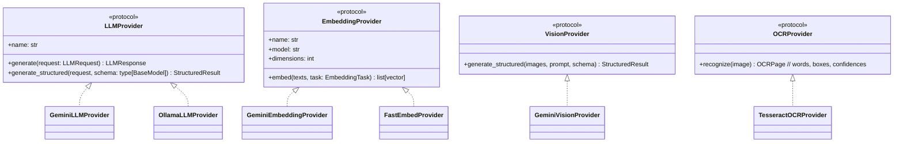
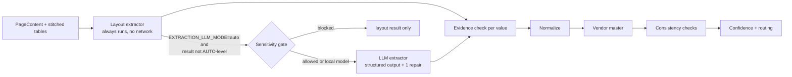

# 06 — AI / ML / LLM Architecture

Principle: **deterministic first, model second, LLM last** — and every model
output is validated, grounded, and auditable. The LLM never decides a fact that
code can compute.

## 1. Provider abstraction (Module 43)

| Interface | Default (Phase) | Local alternative (Phase) |
|---|---|---|
| `LLMProvider` | Gemini via `google-genai` 2.x (**0**) | Ollama HTTP API (**4**) |
| `EmbeddingProvider` | Gemini `gemini-embedding-001`, 768-d, L2-normalized (**0**) | `fastembed` `BAAI/bge-base-en-v1.5`, 768-d, optional extra (**6**); `hashing` — offline signed feature hashing, lexical only, for evaluation and air-gapped demos (**6**, ADR-042) |
| `VisionProvider` | Page images in the extraction request (`LLMRequest.images`; Gemini, **4** — ADR-024) | Ollama vision model (`OLLAMA_VISION=true`, **4**) |
| `OCRProvider` | Tesseract 5 via subprocess (**3**) | — (already local) |

Cross-cutting concerns implemented **once** in the provider layer:

* **Structured output**: JSON schema derived from Pydantic models
  (`response_mime_type=application/json`, `response_json_schema`), then
  *re-validated* locally with Pydantic. Malformed JSON → typed
  `StructuredOutputError` carrying the raw text for one repair attempt by the
  caller; never a crash, never silently accepted.
* **Retries**: transient HTTP codes (408/429/500/502/503/504) retried by the SDK
  with exponential backoff + jitter; attempts/timeouts configurable.
* **Client-side rate limiting**: async token bucket (`LLM_REQUESTS_PER_MINUTE`)
  so free-tier RPM limits are respected proactively instead of via 429 storms.
* **Usage accounting**: every call returns `LLMUsage` (input/output/thinking
  tokens, latency, model); Phase 4 persists it to `llm_calls` (Prometheus metrics in
  Phase 9). Prompts/completions are **not** stored.
* **Error taxonomy**: `ProviderConfigurationError`, `ProviderRateLimitError`,
  `ProviderUnavailableError`, `ProviderResponseError`, `StructuredOutputError`
  — callers branch on type, not on SDK internals.
* **Sensitivity routing** (Phase 3, implemented): `ExternalAIGate` allows external calls only up
  to `AI_EXTERNAL_MAX_SENSITIVITY`, see C1 and §4.

## 2. Model selection (verified 2026-10-08, configurable)

| Purpose | Setting | Default | Why |
|---|---|---|---|
| Extraction, agent analysis, RAG answers | `GEMINI_MODEL` | `gemini-3.5-flash` | Stable 3.x Flash with the longest published lifetime (shutdown no earlier than May 2027) |
| Classification fallback, query planning | `GEMINI_FAST_MODEL` | `gemini-3.5-flash-lite` | Cheapest/fastest stable 3.5-family model, aimed at classification/extraction |
| Embeddings | `GEMINI_EMBEDDING_MODEL` | `gemini-embedding-001` | GA, documented in the SDK; supports `output_dimensionality=768` (needs client-side normalization, which we always do) |

Why pin versions instead of `gemini-flash-latest`: evaluations must be
reproducible; an alias silently changes behaviour. `make check-ai` lists the
models available to *your* key — if Google retires a default, change one env var.
Free-tier quotas differ per model and change often; check AI Studio for current
limits instead of trusting numbers in docs.

Gemini 3.x notes honoured by the implementation: sampling parameters
(`temperature/top_p/top_k`) are only sent if explicitly configured; thinking is
controlled by `thinking_level` (`LOW/MEDIUM/HIGH`), optional.

## 3. OCR & document understanding (Module 3, Phase 3 — implemented)

Per **page**, not per document (mixed PDFs are common). Code: `docintel/processing/`.

1. **Inspect** (`inspection.py`): per-page character and image counts decide `NATIVE` vs
   `OCR` (ADR-017).
2. **Native text** (`native.py`): pypdfium2 character boxes (loose boxes: advance width and
   font ascent/descent) grouped into words, converted to the page's displayed orientation with
   a top-left origin. A text layer whose characters are mostly unusable (private-use glyphs,
   replacement characters) is OCR'd instead. pdfplumber is not used (ADR-021).
3. **OCR** (`ocr.py`, `extraction.py`, `preprocess.py`): PDF pages rendered at 300 DPI; images
   used as stored (EXIF orientation applied) and upscaled up to 2x below 250 DPI; projection-
   profile **deskew** (rotation within ±5°); Tesseract 5 via subprocess (`tsv` output, per-page
   timeout, `OMP_THREAD_LIMIT=1`, pages in parallel); a poor reading triggers orientation
   detection (`--psm 0`) and the better of the two readings is kept; ruling-line debris and
   noise tokens are dropped. Every step was kept or rejected by measurement
   (`evaluation/reports/ocr.md`): median filtering, autocontrast and ruling-line removal made
   synthetic scans worse and are off.
4. **Layout** (`layout.py`): skew-tolerant line grouping, column segments (gap > 0.75 × text
   size), blocks in reading order, label/value grids read row by row, headings by size.
5. **Tables** (`tables.py`): one geometry-based detector for native and OCR pages (header row
   of short labels, column boundaries that cut the fewest words, wrapped cells, row-rhythm
   stop, a column for row numbers whose header OCR lost), stitched across pages under the same
   header (ADR-021).
6. **Normalized representation** (`content.py`): `PageContent{page_number, width, height, unit,
   method, words[], lines[], blocks[], tables[], ocr_confidence, rotation_applied,
   deskew_degrees}` — the single format consumed by every downstream stage. Persisted in
   `document_pages` (words and layout as JSONB) and `document_tables`/`table_rows`; a PNG
   preview per page goes to document storage.

**Vision fallback in extraction.** The plan sent low-confidence OCR pages to a vision model
here. Phase 4's extraction call attaches the images of low-confidence pages instead, which
covers the same need with one call instead of two (ADR-024). Phase 3 flags such pages
(`LOW_OCR_CONFIDENCE` review reason).

Licences: pypdfium2 (Apache-2.0/BSD-3), Tesseract (Apache-2.0), scikit-learn (BSD-3),
RapidFuzz (MIT). PyMuPDF rejected (AGPL-3.0).

## 4. Classification (Module 4, Phase 3 — implemented)

Code: `docintel/classification/`.

* **Stage 1 — local model**: TF-IDF (word 1–2-grams + character 3–5-grams on lower-cased text
  with digits collapsed) + logistic regression, Platt-calibrated (`CalibratedClassifierCV`,
  sigmoid, 3-fold). Trained **when the worker starts** on a seeded synthetic corpus covering
  all nine types plus current human corrections (ADR-022); ~9–20 s, deterministic, no model
  file to trust. Every prediction records the model fingerprint.
* **Stage 2 — LLM fallback** when the local probability is below
  `CLASSIFICATION_MIN_CONFIDENCE` (0.7) **and** the sensitivity gate allows external AI: the
  fast model picks one label from the fixed list (enum-constrained structured output) and
  quotes the text that supports it. The document text is passed as untrusted data.
* **Confidence**: the local calibrated probability when stage 1 decides. When the LLM decides,
  confidence comes from agreement signals only — agreement with the local top-1 (≥ 0.80) or
  runner-up (0.65), keyword evidence (±0.10), and whether the quoted evidence is actually in
  the text (−0.10 if not) — never from the LLM's own certainty (ADR-005).
* **Routing**: below the threshold after both stages, or no LLM allowed/configured, the
  document becomes `REVIEW_REQUIRED` with reason `CLASSIFICATION_UNCERTAIN`; the best local
  guess is kept for the reviewer. LLM errors degrade to review; they never fail the job.
* **Human correction** (`PATCH /documents/{id}/classification`) creates a `HUMAN`
  classification that later processing never overrides, and becomes training data at the next
  worker start.
* **Sensitivity gate** (`docintel/ai/routing.py`): effective sensitivity = max(label set at
  upload, content findings, type minimum of the likely types); content findings are Luhn-valid
  payment card numbers and US SSNs (→ RESTRICTED); resumes and bank statements are at least
  CONFIDENTIAL; IBANs and e-mail addresses are recorded without raising the level. Only counts
  and page numbers are stored. Above `AI_EXTERNAL_MAX_SENSITIVITY` nothing leaves the worker.

## 5. Structured extraction (Modules 6–8, Phase 4 — implemented)

Code: `docintel/fields/`. Pipeline stage `fields`, after classification, for the eight types
that have a schema (`OTHER` has none).

* **Schemas** (`schemas.py`, Pydantic, versioned): `InvoiceV1`, `PurchaseOrderV1`,
  `ReceiptV1`, `DeliveryNoteV1`, `ContractV1`, `ResumeV1`, `BankStatementV1`, `PolicyV1`.
  Every scalar is `ExtractedValue{value, page, source_text}` and every table row carries
  `page` and `source_text`, so the model must cite where it read each value. Field metadata
  (type, required, printed labels, letterhead position) drives both extractors; the schema
  is the single source of truth.
* **Layout extractor** (`local.py`, ADR-028): finds printed labels (same line, same column
  segment, the line below, the neighbouring line on skewed scans, OCR-damaged labels with
  RapidFuzz ≥ 90), the issuer name in the letterhead (largest text in the top 30% of page 1,
  never another schema's label or a document title), table columns by header synonyms and
  content, section lists for contracts, resumes and policies. Each candidate records how it was
  found (`method`) and how strong that rule is (`anchor`, 0.6–1.0).
* **LLM extractor** (`llm.py`): `EXTRACTION_LLM_MODE` = `auto` (call the model only when the
  layout result would not be auto-accepted), `always` or `never`. One call per document
  version with all fields; page-tagged text inside a delimited untrusted-data block
  (`<document>…</document>`, tag look-alikes in the text are neutralized), tables in the page
  text, and page images for pages whose OCR confidence is below
  `EXTRACTION_VISION_BELOW_OCR_CONFIDENCE` (at most `EXTRACTION_MAX_IMAGES`, ADR-024).
  Pydantic validates the output; one repair round-trip with the validation errors, else the
  layout result stands. Outputs are cached by a hash of prompt version, system instruction,
  schema, model, prompt text and images.
* **Merge** (field by field): both sources agree → agreement signal. They disagree → the value
  the vendor master recognizes (vendor name), else the one with better evidence, else the
  layout value if its rule is strong (anchor ≥ 0.95), else the model's; the other value is
  stored as an alternative and shown to the reviewer.
* **Evidence** (`evidence.py`, anti-hallucination): the quote must be on the cited page (word
  boundaries, whitespace-insensitive) → `VERIFIED`; RapidFuzz alignment ≥
  `EVIDENCE_FUZZY_THRESHOLD` → `FUZZY`; on the page but the value is not in the quote →
  `UNSUPPORTED`; else `NOT_FOUND`. A model value without a usable quote counts only if the
  value itself (≥ 6 characters) is printed on the page. The bounding box comes from the matched
  words.
* **Normalization** (`normalize.py`): amounts as `Decimal` (decimal comma inferred per
  document), ISO 4217 currency (explicit code > vendor default > the one currency printed on
  the page > assumed from `$`), dates with explicit order rules (`03/04/2026` is decided by
  unambiguous dates or the currency on the same document, dotted dates are day-first, else
  `UNCERTAIN` with both readings), percentages as fractions, payment terms in days. The printed
  `original_value` is always kept.
* **Vendor master** (`vendors.py`, table `vendors`): tax ID > exact alias > name similarity ≥
  `VENDOR_MATCH_MIN_SCORE` on organization keys (legal suffixes removed; PostgreSQL `pg_trgm`
  pre-filter). A match links the document to the vendor and supplies the default currency.
* **Consistency checks** (`validation.py`): qty × unit price = line amount; Σ lines = subtotal
  (or total); subtotal + tax = total; subtotal × tax rate = tax; invoice date + payment terms =
  due date (else due date not before invoice date); period/effective start not after end;
  opening balance + credits − debits = closing balance. Tolerance
  `EXTRACTION_ARITHMETIC_TOLERANCE`. A failed check never changes a value; it lowers the
  confidence of the fields involved and forces review.
* **Line items are required** for invoices, purchase orders, delivery notes and bank
  statements (ADR-033): a row-count pseudo-field is required, so a document whose table was
  not found cannot be auto-accepted. A reviewer confirms "no rows" with an empty correction.
  Within a row, columns a line item cannot do without (quantity; amount for priced lines) are
  *essential*: a row missing one gets an explicit `NOT_FOUND` cell with confidence 0.
* **Human corrections** (`PATCH /documents/{id}/extraction/fields/{field_id}`): the reviewer
  types the value as printed; it is normalized and re-scored like any other value, kept on
  reprocessing of the same version and schema, and audited without the value (ADR-032).

## 6. Confidence model (Module 26, implemented)

A field's confidence is the **product** of factors from measured signals (`confidence.py`,
ADR-030). The model's own certainty is not an input (ADR-005).

| Signal | Factor |
|---|---|
| evidence | VERIFIED 1.0 · FUZZY score/100 · UNSUPPORTED 0.1 · NOT_FOUND 0 |
| normalization | OK 1.0 · UNCERTAIN 0.6 (e.g. ambiguous day/month) · INVALID 0 |
| ocr | native text 1.0, else 0.5 + 0.5 × mean word confidence of the evidence |
| anchor | strength of the layout rule (exact label 1.0 … weak letterhead guess 0.6) |
| conflicts | 0.8 when the same rule found different values |
| page | 0.95 when the model cited the wrong page |
| consistency | 0.6 when every check involving the field failed |
| agreement | two sources agree 1.0 · single source 0.9 · only the LLM read it 0.8 · disagree 0.6 |

* A value only the model found is printed on the page, but nothing shows it is the right
  field (text on the page can talk a model into quoting it), so with the default thresholds it
  is never auto-accepted on its own (`tests/security/test_prompt_injection.py`).
* Document confidence = the weakest of the **required** scalar fields (missing = 0) and the
  line-item cells (row numbers and units excluded).
* Routing: ≥ `EXTRACTION_CONFIDENCE_HIGH` (0.85) and no failed check → `AUTO`; ≥
  `EXTRACTION_CONFIDENCE_MEDIUM` (0.6) → `ANALYST_REVIEW`; else `MANDATORY_REVIEW`. Anything
  but `AUTO` adds a review reason (`MISSING_REQUIRED_FIELDS`, `EXTRACTION_UNCERTAIN`,
  `EXTRACTION_INCONSISTENT`, `EXTRACTION_FAILED`) and the document becomes `REVIEW_REQUIRED`.
* The factor values are design choices. Whether they are good is measured, not assumed: the
  extraction evaluation reports the error rate inside the auto-accepted bucket
  (`evaluation/reports/extraction.md`). Calibration on held-out labelled data (ECE) is
  Phase 10.

## 7. Cost & quota control (free-tier strategy, implemented in Phase 4)

1. Deterministic stages first (native text, layout rules, normalization, checks) — zero LLM
   calls. In `auto` mode the extraction LLM is called only when the layout result would not be
   auto-accepted.
2. Local classifier handles confident cases; LLM only for the uncertain tail.
3. One extraction call per document version (all fields at once), cached by input hash
   (identical input → stored output, no call).
4. Embeddings batched (`EMBEDDING_BATCH_SIZE`); chunks are embedded once at ingestion and
   `docintel reembed` only touches chunks without a vector of the configured model (Phase 6).
   Retrieval answers questions without any model call when the evidence gate fails, and
   `RAG_GENERATION_ENABLED=false` turns answers into retrieval only.
5. Client-side token bucket + SDK retries; `LLM_DAILY_REQUEST_BUDGET` (0 = unlimited) is
   checked before every call; when it is used up the call fails with
   `ProviderBudgetExceededError`, the error is recorded in the extraction's signals, and the
   layout result is kept and routed by its own confidence (in `auto` mode that means review).
6. Every call is recorded in `llm_calls` (provider, model, purpose, document, prompt version,
   tokens, latency, status, estimated cost) — never prompts or completions. `docintel
   llm-usage` reports per day. Cost is estimated only from prices you configure in
   `LLM_PRICING` (none are shipped: published prices change and could not be verified,
   ADR-031); a local model costs 0.
7. **Local provider** (`LLM_PROVIDER=ollama`): extraction and classification can run on a
   self-hosted model. Content stays in the deployment, so the external-AI sensitivity gate
   does not block it (ADR-029); `make check-ai` verifies it.
