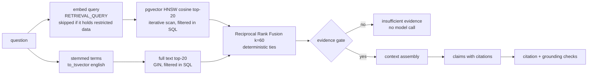

# 07 — RAG Architecture (Modules 12, 13, 28)

Goal: answers about company policy that are **grounded, cited, access-controlled
and measurably good** — or an explicit "insufficient evidence". This document
describes what is implemented (Phase 6); decisions are ADR-042 … ADR-048.

## 1. Ingestion pipeline

```
POST /api/v1/knowledge/documents  (Markdown, text, PDF, PNG, JPEG, TIFF)
  → validation (text: UTF-8, no binary, size; files: the business-document gate)
  → metadata: form fields, then front matter (title, document_key, version, category,
    effective_from/to, sensitivity, department), then defaults
  → scope and version checks → blob + row + KNOWLEDGE_PROCESSING job + audit (one transaction)
worker:
  → integrity (re-hash the stored file)
  → parse: Markdown/text directly; PDFs and images through the same text-layer/OCR
    extraction and layout analysis as business documents
  → structure-aware chunking → content sensitivity scan
  → embeddings (batched, RETRIEVAL_DOCUMENT) behind the sensitivity gate
  → one transaction: chunks replaced, version state decided, audit
```

Business documents get the same treatment in an `index` stage of their own
pipeline (`document_chunks`, current version only; deleted documents leave the index).

**Chunking** (`knowledge/chunking.py`, ADR-043)

* Sections first (Markdown `#` headings; numbered and large headings in PDFs and
  plain text). A chunk never crosses a section, so every citation names one section.
* Paragraphs are packed to ~500 tokens (hard max 800; longer paragraphs split at
  sentences, then words). Consecutive chunks of a section share ~75 tokens of whole
  sentences; nothing overlaps across sections.
* Tables stay whole up to the maximum; longer ones are split by row groups with the
  header repeated.
* `context_prefix` = document title + breadcrumb (`4. Price variance › 4.1 Tolerance`).
  It is stored separately from the content and is part of both the embedded text and
  the full-text vector (`setweight` A for the prefix, B for the content).
* Tokens are estimated as characters / 4; budgets are approximate by design.

**Metadata on every chunk** (filterable columns): status, department, category,
effective sensitivity, retrieval window (`effective_from/to`), embedding model.

**Versions** (`knowledge/lifecycle.py`, ADR-044): rows with the same `document_key`
are versions; at most one is ACTIVE. A processed version becomes ACTIVE if it takes
effect later than the active one (same or unknown date: the later upload), otherwise
it is kept as SUPERSEDED history. Each version's *retrieval window* is copied onto its
chunks: the effective dates, with the end capped the day before the next version
starts. Archiving the active version restores the latest earlier one.

**Embeddings** (`knowledge/embedding.py`, ADR-042): `gemini`, `fastembed` (local) or
`hashing` (offline, lexical). External providers receive only chunks at or below
`AI_EXTERNAL_MAX_SENSITIVITY` (label or detected content). A chunk without a vector is
found by full-text search; `docintel reembed` adds vectors later.

## 2. Retrieval (`knowledge/retrieval.py`, ADR-045)



* **Filters in SQL**, inside both scans: organization-wide chunks plus the user's
  department (administrators: all); status ACTIVE or SUPERSEDED with the retrieval
  window containing `as_of` (default today); optional categories and document keys.
  Unauthorized or out-of-date chunks never leave the database.
* **Full-text order**: when full text is the only retriever (no embedding provider),
  candidates are ordered by the IDF-weighted share of the question's terms they
  contain; when fused with vectors, by `ts_rank_cd` — the better choice in each mode
  on the kb-queries tuning set.
* **Evidence gate**: the best of the top five passages must cover ≥
  `RAG_MIN_TERM_COVERAGE` (0.25) of the question's terms weighted by rarity, or reach
  `RAG_MIN_DENSE_SIMILARITY` (0.5, model-specific).
* **Reranking**: none. A cross-encoder or LLM reranker is only worth adding if the
  evaluation shows a gain worth its latency and cost.

## 3. Context assembly (`knowledge/answering.py`)

* Passages in rank order are labelled `S1…Sn`; consecutive chunks of one section are
  merged (their overlap removed); duplicate texts are dropped; the context stops at
  `RAG_MAX_CONTEXT_TOKENS` (the top source is always included).
* Each source header carries title, version, period in force and section path.
* **Per-source sensitivity gate** (ADR-047): sources above the external limit are not
  sent to an external model; they are still returned to the user (`sent_to_model:
  false`, with a notice). If no source may be sent, the answer is `RETRIEVAL_ONLY`.
* Sources are wrapped in markers with a per-request random nonce (a source cannot close
  the block); the system instruction declares them untrusted data whose instructions
  must be ignored.

## 4. Generation and hallucination safeguards (ADR-046)

Structured output — claims only:

```json
{"claims": [{"text": "string", "citations": ["S1", "S3"]}], "insufficient_evidence": false}
```

1. **Retrieval gate** — no generation below the evidence thresholds.
2. **Citation validation** — citations must name provided sources; claims without one
   are removed (status `PARTIALLY_SUPPORTED`).
3. **Grounding check** — every number in a claim must occur in its cited text and ≥ 60%
   of its content words; failing claims are kept but flagged for the reader.
4. **Answer from claims** — the text shown is the surviving claims with their
   citations, never free model prose.
5. **No tool execution from retrieved text** — RAG output is data for the agent.
6. **Deterministic facts win** — retrieved policy can explain a rule result but cannot
   overturn it: the agent retrieves the policy for each failed rule, and model statements
   that clear a failed rule are removed (docs/architecture/08 §4).

Statuses: `ANSWERED`, `PARTIALLY_SUPPORTED`, `INSUFFICIENT_EVIDENCE`,
`RETRIEVAL_ONLY`. Every query is audited with a fingerprint of the question (never its
text), the passages used, which were cited and which were sent to the model; model
calls are accounted in `llm_calls`.

## 5. Search over business documents (Module 28, ADR-048)

`POST /api/v1/search` — a deterministic parser turns the request into filters plus
free text and returns its interpretation:

* "Find all invoices from Vendor X" → type INVOICE + vendor (vendor master by key,
  alias or name; printed names otherwise). No vectors needed.
* "Contracts containing termination clauses" → type CONTRACT + hybrid search for
  "termination clauses" over `document_chunks`, grouped per document with a snippet.
* "Documents with payment terms longer than 60 days" → `payment_terms_days > 60` on
  the current extraction (corrections win); documents whose terms were not extracted
  are matched from terms written in their text, and the result says so.
* Totals ("over 10,000"), months, years and ISO date ranges on the document date.

Access is the same SQL predicate as every document read.

## 6. Evaluation (`docintel evaluate --suite retrieval|search`, 10-evaluation-plan.md)

Measured with the offline hashing embeddings (semantic models: Not yet measured):
hit@k, section recall@5, precision@5, MRR, nDCG@5 on kb-queries (tuning set) and
kb-queries-holdout; the evidence gate's refusals; access-control and version checks;
ablations dense vs full text vs hybrid, full-text order, contextual prefix off,
fixed-size chunks; business search precision/recall per question family. Results:
[retrieval report](../../evaluation/reports/retrieval.md),
[search report](../../evaluation/reports/search.md). Generated-answer quality
(citation precision/recall, faithfulness) needs an LLM: Not yet measured.
EOF
grep -n "^## \|Phase 6\|knowledge\|RAG\|retrieval" docs/architecture/10-evaluation-plan.md | head -30