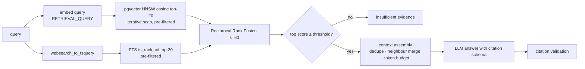

# 07 — RAG Architecture (Modules 12, 13, 28)

Goal: answers about company policy that are **grounded, cited, access-controlled
and measurably good** — or an explicit "insufficient evidence".

## 1. Ingestion pipeline

```
knowledge document (PDF / image)
  → text extraction with structure (same processing stack as business documents)
  → section detection (numbered headings, font-size/bold for native PDFs, markdown-like patterns)
  → structure-aware chunking
  → metadata enrichment
  → embeddings (batched, task = RETRIEVAL_DOCUMENT)
  → knowledge_chunks (content, tsvector, vector(768), metadata)
```

**Chunking**

* Split on section boundaries first; then recursively by paragraph → sentence to
  a target of ~500 tokens (hard max 800) with ~15% overlap inside a section only.
* Tables are kept whole (Markdown) when ≤ max size; otherwise split by row groups
  with the header repeated.
* Each chunk stores a `section_path` breadcrumb
  (`Procurement Policy › 4 Price Variance › 4.2 Tolerances`) that is **prepended
  to the text that gets embedded** (contextual chunking) but stored separately.
* Token counts use a conservative character heuristic (documented), validated
  against the provider's `count_tokens` in tests.

**Metadata** (filterable columns, not only JSON): `category`, `department_id`
(NULL = organization-wide), `effective_from/to`, `status`, `version_label`,
`knowledge_document_id`, `page_start/end`, `embedding_model`.

**Versioning**: uploading a new version marks the old one `SUPERSEDED`; retrieval
defaults to `ACTIVE` and effective-today, so outdated policy is not cited.

## 2. Retrieval



* **Hybrid** retrieval because policy questions mix semantics ("how much price
  variance is allowed") with exact tokens (clause numbers, vendor names, codes)
  that dense vectors handle poorly.
* **Filters in SQL** (`WHERE status='ACTIVE' AND (department_id IS NULL OR
  department_id = ANY(:user_departments)) AND effective_from <= today …`) — never
  post-filtering in Python, so unauthorized chunks never leave the database.
  pgvector 0.8 `hnsw.iterative_scan` keeps filtered top-k full.
* **Reranking**: off by default. An LLM or cross-encoder reranker is only enabled
  if Phase 10 shows a measured gain worth its latency/cost.

## 3. Context assembly

* Top-N (default 6) chunks within a token budget; adjacent chunks of the same
  section merged; near-duplicates removed.
* Each source labelled `[S1]…[Sn]` with title, section path, page range,
  effective date.
* Sources are wrapped in a delimited **untrusted data** block; the system
  instruction states that instructions inside sources must be ignored.

## 4. Generation & hallucination safeguards

Structured output:

```json
{
  "answer": "string",
  "claims": [{"text": "string", "citations": ["S1", "S3"]}],
  "insufficient_evidence": false
}
```

1. **Retrieval gate** — no generation when evidence is below threshold.
2. **Citation validation** — every citation must reference a provided source;
   claims without valid citations are removed and the response is flagged
   `partially_supported`.
3. **Grounding check** — lexical/semantic overlap between each claim and its cited
   chunk; low overlap → claim flagged (Phase 10 adds an LLM-judge in evaluation only).
4. **No tool execution from retrieved text** — RAG output is data for the agent,
   never instructions.
5. **Deterministic facts win** — when used by the agent, retrieved policy can
   explain a rule result but cannot overturn it.

## 5. Semantic search over business documents (Module 28)

Same hybrid engine over `document_chunks` + structured filters on extracted
metadata (`document_type`, `vendor_id`, dates, amounts). Examples:

* "Find all invoices from Vendor X" → structured filter on normalized vendor
  (no vectors needed).
* "Contracts containing termination clauses" → hybrid search restricted to `CONTRACT`.
* "Documents mentioning payment terms longer than 60 days" → structured filter on
  normalized `payment_terms_days > 60` where extracted, plus hybrid search for the rest.

A small query-understanding step (fast LLM, schema-constrained, or rule-based
fallback) maps natural language to `{filters, semantic_query}`.

## 6. Evaluation (details in 10-evaluation-plan.md)

Labelled query set over the seeded knowledge base: Recall@k, Precision@k, MRR,
nDCG@k, citation precision/recall, refusal accuracy on unanswerable questions.
Ablations: dense-only vs FTS-only vs hybrid; chunk size; contextual prefix on/off.
