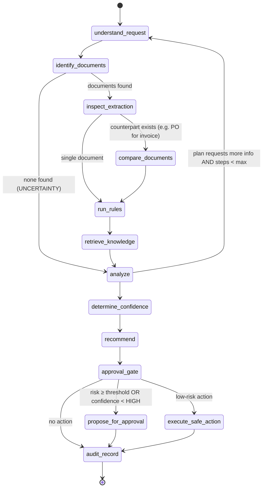
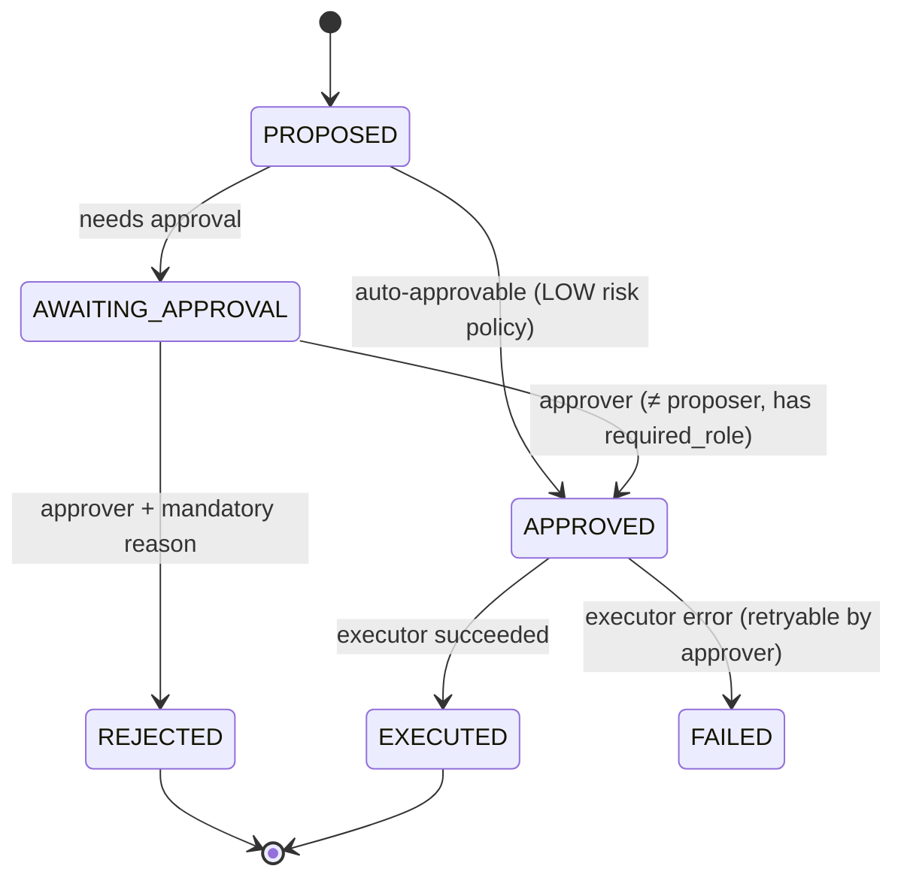

# 08 — Agent Architecture: State Graph, Tools, MCP (Modules 11, 14–17)

## 1. Design stance

* **LangGraph** for explicit, inspectable state and conditional routing.
  LangGraph is used without LangChain model wrappers: nodes call our own
  `LLMProvider`, so the provider abstraction and usage accounting stay intact.
* **Plan-and-execute with bounds**, not an open-ended ReAct loop: the LLM produces
  a *typed plan* (which tools, which arguments); a deterministic executor runs it
  under permission checks; the loop is capped (`AGENT_MAX_STEPS`,
  `AGENT_MAX_LLM_CALLS`, wall-clock timeout).
* The agent acts **as the requesting user** — it can never see or do more than
  that user could through the REST API.
* The agent can only **propose** high-impact actions. Execution happens after
  human approval through an allowlisted executor (C7 in requirements).
* Output is a structured result. Hidden reasoning (model "thoughts") is never
  requested for display, stored, or returned.

## 2. State

```python
class InvestigationState(TypedDict):
    run_id: UUID
    actor: ActorContext                      # user id, role, departments (for tool authz)
    query: str                               # untrusted user text
    plan: Plan | None                        # intent, document refs, tool requests
    documents: dict[UUID, DocumentSummary]
    extractions: dict[UUID, ExtractionView]
    comparisons: list[ComparisonView]
    rule_results: list[RuleResultView]
    knowledge: list[RetrievedSource]         # [S1..Sn] with ids
    findings: list[Finding]                  # category ∈ OBSERVED_FACT | RULE_RESULT |
                                             #   RETRIEVED_KNOWLEDGE | AI_INFERENCE | UNCERTAINTY
                                             # each with evidence refs (field ids, rule ids, source ids)
    confidence: ConfidenceAssessment | None  # computed, not LLM-claimed
    recommendation: Recommendation | None    # allowlisted action type + rationale
    proposed_actions: list[ProposedAction]
    step_count: int
    errors: list[str]
```

## 3. Graph



| Node | Kind | Notes |
|---|---|---|
| `understand_request` | LLM (fast model) | Query → `Plan` (intent enum, referenced documents/vendors/numbers, requested outputs). Query text is treated as data. |
| `identify_documents` | tools | `search_documents`, `get_document`; access-scoped |
| `inspect_extraction` | tools | `get_extracted_fields`, `get_document_evidence` |
| `compare_documents` | tool | Deterministic comparison engine |
| `run_rules` | tool | Deterministic rule engine |
| `retrieve_knowledge` | tool | `search_knowledge_base` with queries derived from plan + failed rules |
| `analyze` | LLM (main model) | Inputs are read-only facts; output = findings with categories and evidence refs. A validator rejects findings that contradict `OBSERVED_FACT`/`RULE_RESULT` or cite unknown evidence. |
| `determine_confidence` | deterministic | From extraction confidence, evidence status, rule outcomes, retrieval scores, citation validity |
| `recommend` | LLM-proposed, rule-constrained | Must pick from the allowlist; guardrails (e.g. any CRITICAL failure ⇒ cannot recommend `APPROVE_FOR_PAYMENT`) |
| `approval_gate` | deterministic | Risk policy table |
| `propose_for_approval` | write | `workflow_actions` (`AWAITING_APPROVAL`) + `review_tasks`; run → `AWAITING_APPROVAL` |
| `execute_safe_action` | write | Only LOW-risk actions (create review task, generate report) |
| `audit_record` | write | Audit entry with run summary |

## 4. Tools (Module 15)

Every tool is a `Tool[In, Out]` with: Pydantic input/output models
(`extra="forbid"`), required permission, side-effect class, timeout, output size
cap, and audit logging (`agent_tool_calls`). No shell, filesystem, network, SQL
or code-execution tools exist.

| Tool | Side effect | Permission | Input (validated) | Output |
|---|---|---|---|---|
| `search_documents` | READ | `documents:read` | query ≤ 500 chars, filters, `limit ≤ 20` | id, type, vendor, date, status |
| `get_document` | READ | `documents:read` | `document_id` | metadata + classification + confidence |
| `get_extracted_fields` | READ | `documents:read` | `document_id`, optional field paths | normalized fields + confidence |
| `get_document_evidence` | READ | `documents:read` | `document_id`, `field_path` | page, source_text, bbox, evidence status |
| `search_knowledge_base` | READ | `knowledge:read` | query, category, `top_k ≤ 10` | cited sources |
| `compare_documents` | RECORD | `comparisons:create` | ≥2 document ids + type | comparison results |
| `run_business_rules` | RECORD | `comparisons:create` | document ids or comparison id | rule results |
| `create_review_task` | LOW-RISK WRITE | `reviews:work` | document id, reason ≤ 1000 chars, priority | task id |
| `generate_report` | LOW-RISK WRITE | `reports:create` | subject type/id, report type | report id |
| `get_workflow_status` | READ | `workflows:read` | workflow id | status, pending actions |

Authorization failures return a `DENIED` tool result (logged) — the model sees
"not found or not permitted", never details about inaccessible resources.

## 5. HITL state machine (Module 17)



Each transition writes `workflow_action_transitions` + `audit_logs` in the same
transaction. Executors are idempotent (`idempotency_key`).

## 6. MCP (Module 16)

**Value it adds:** lets an analyst use the platform's verified tools from an MCP
client (IDE, desktop assistant) without copying sensitive documents into that
client, while keeping RBAC, scoping and audit identical to the web UI.

* Implemented with the official `mcp` Python SDK as a thin adapter over the same
  tool registry (no duplicated logic).
* Exposed tools: `search_documents`, `get_document`, `compare_documents`,
  `search_policy` (= `search_knowledge_base`), `run_validation`
  (= `run_business_rules`), `create_review_task`, `generate_report`.
* Transports: stdio (local) and streamable HTTP behind auth.
* Auth: per-user API tokens (hashed, scoped, expiring, revocable); every call is
  audited with `actor_type=USER, details.via=mcp`.
* No approval/execution tools over MCP.
