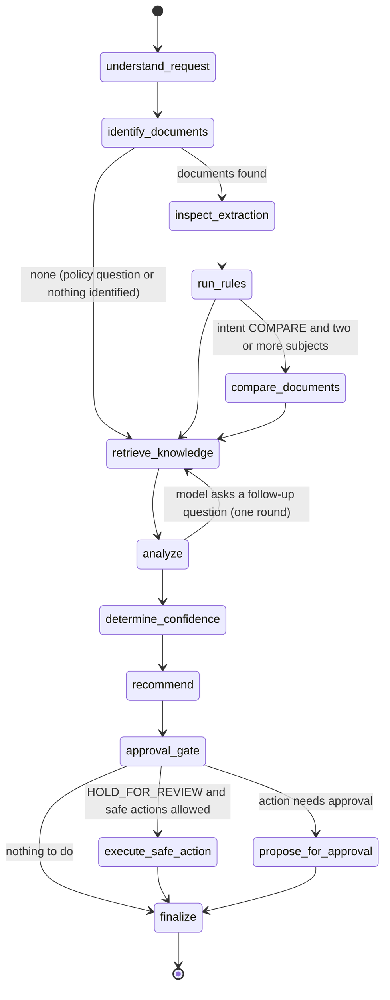
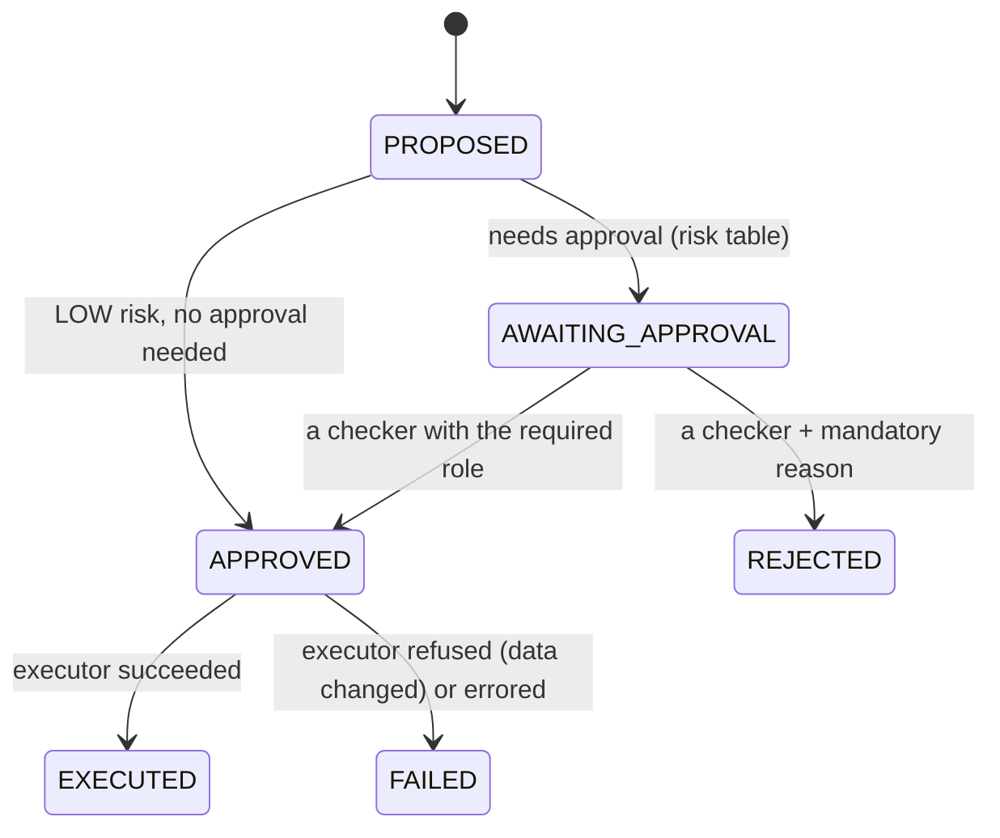

# 08 — Agent Architecture: State Graph, Tools, MCP (Modules 14–17)

This document describes the investigation agent as built in Phase 7 (decisions:
ADR-049 … ADR-055) and the workflows with human approval built on it in Phase 8 (§8,
ADR-056 … ADR-062).

## 1. Design stance

* **LangGraph with explicit state** — a `StateGraph` over a typed state dict; nodes
  call our own `LLMProvider` (no LangChain model wrappers), so usage accounting,
  the daily budget and the sensitivity gate apply unchanged.
* **The model never chooses tools.** It may fill a typed plan (an intent from a
  closed list, search text, document numbers, policy questions) and write findings;
  the graph decides which tools run. A request cannot talk the agent into calling
  something else, and there is nothing else to call (no shell, file, network, SQL
  or code tool exists).
* **Facts come from tools, as the requesting user.** Every tool call reloads the
  user, checks the tool's permission and runs through the same services and
  access-policy predicates as the REST API.
* **Deterministic first.** Without a model (none configured, `AGENT_LLM_ENABLED=false`,
  or content above the external AI limit) the graph still plans, gathers facts,
  writes findings, assesses confidence and recommends — measured in
  `evaluation/reports/agent.md`.
* **Propose, don't act** — the only action an investigation may execute is the
  low-risk one (request a human review); everything else is proposed for approval.
* **No hidden reasoning** is requested, stored or shown: the result is findings with
  evidence labels, a summary, a confidence with its factors and a recommendation.

## 2. State (`agent/state.py`)

```python
class InvestigationState(TypedDict, total=False):
    run_id, user_id, query: str
    requested_documents: list[str]       # ids the user named (all visible to them)
    allow_safe_actions: bool
    plan: Plan                           # intent, document_query, identifiers,
                                         # knowledge_questions, focus_fields, source
    documents: dict[str, DocumentInfo]   # get_document outputs
    document_roles: dict[str, str]       # "subject" | "related" (order, deliveries, duplicate)
    identified_by: str                   # "request" | "search" | "none"
    extractions, evidence, rules: dict   # tool outputs per document
    comparisons: list                    # compare_documents outputs (+ members)
    knowledge: list                      # passages, labelled K1..Kn
    knowledge_queries, pending_questions: list[str]
    analysis: dict                       # findings, evidence catalogue, summary, proposal
    confidence, recommendation: dict
    action_route: str                    # approval_gate: execute | propose | none
    action: dict | None                  # EXECUTED | PROPOSED | SKIPPED | FAILED
    rounds: int
    notices, tool_calls, trace: Annotated[list, operator.add]   # accumulated
```

Values are JSON-compatible, so the final state is stored as is (`agent_runs.result`,
`plan`, `trace`); `agent_tool_calls` holds every call.

## 3. Graph (`agent/graph.py`)



| Node | Kind | What it does |
|---|---|---|
| `understand_request` | model (FAST tier) or keyword rules | Plan from the request only (wrapped in per-request markers). Keyword planner: intent patterns; questions that name no document and point at none go to the knowledge base; a search phrase from document numbers, the first document type, a month and a vendor name ("INV-7 invoice in May 2026 from Kestrel"). |
| `identify_documents` | tools | `get_document` for named documents; otherwise `search_documents`, keeping only exact matches when the request names a document number (own number first, else the order number a document quotes). Several matches without a number are investigated together, with a notice. |
| `inspect_extraction` | tools | `get_extracted_fields`; `get_document_evidence` for the total, focus fields and the weakest required fields (≤ 3 per document). |
| `run_rules` | tools | `run_business_rules` (a dry run of matching and every enabled rule on current data — nothing stored); counterparts (order, delivery notes, duplicates) added as related documents. |
| `compare_documents` | tool | Only for a comparison request on two or more invoices, orders or delivery notes not already compared by matching; the result is stored (MANUAL). |
| `retrieve_knowledge` | tool | `search_knowledge_base` for the plan's questions and the failed/unconfirmed rules (most severe first, ≤ 3 queries, ≤ 8 passages); passages kept only when the evidence gate passes. |
| `analyze` | rules, then model | Evidence catalogue (D1, D1.F3, D1.R2, D1.C1, M1, K1…); deterministic findings; optional model findings, summary and proposal, validated (§4). |
| `determine_confidence` | rules | Score 1.0 minus the worst penalty of each kind: identification, extraction review level, unverified key evidence, rules that could not decide or confirm, uncertain comparison items, stale stored outcomes, missing policy, rejected model statements. HIGH ≥ 0.8, MEDIUM ≥ 0.55. |
| `recommend` | rules (+ model proposal) | Allowlisted action; the model's proposal stands only if the guardrails allow it (§5). |
| `approval_gate` | rules | Risk table decides: execute, propose or nothing. |
| `execute_safe_action` | tool | `create_review_task` on the target document with the summary and the failed rules. |
| `propose_for_approval` | record | The action is recorded as PROPOSED with the role that must approve it; nothing is executed. A standalone investigation stops here; inside a workflow the proposal becomes a workflow action that a person decides (§8). |
| `finalize` | — | Budget notices. |

Bounds: `AGENT_MAX_TOOL_CALLS` (30; past it, tools return nothing and the run says
so), `AGENT_MAX_LLM_CALLS` (4), one follow-up retrieval round,
`AGENT_TIMEOUT_SECONDS` (180) for the whole run, `AGENT_TOOL_TIMEOUT_SECONDS` (30)
and `AGENT_TOOL_MAX_OUTPUT_BYTES` per call, `AGENT_MAX_DOCUMENTS` (3) subjects,
`AGENT_MAX_ACTIVE_RUNS_PER_USER` (3, else 429).

**Execution**: `POST /api/v1/analysis` creates the run (`QUEUED`) and an
`AGENT_ANALYSIS` job in the same transaction; the worker runs the graph once (no
automatic retry: a run may already have requested a review and its model calls
cost money), stores plan, result, trace and usage (tool calls, model calls,
tokens, estimated cost from `llm_calls.agent_run_id`) and audits
`analysis.completed` / `analysis.failed` with `actor_type=AGENT` on behalf of the
requester. The request is audited by fingerprint only.

## 4. Findings and their validation (`agent/analysis.py`)

| Category | Written by | Rule |
|---|---|---|
| `OBSERVED_FACT` | rules | Document facts from `get_document` / fields |
| `RULE_RESULT` | rules | Each FAIL/WARN outcome with its comparison items; "all N rules passed"; requested comparisons |
| `UNCERTAINTY` | rules | Rules that could not decide, missing or weak required fields, nothing identified |
| `RETRIEVED_KNOWLEDGE` | rules (reference) or model | Model claims must cite a K label and pass the RAG grounding check (numbers, ≥ 60% of words); ungrounded ones are kept but flagged |
| `AI_INFERENCE` | model | Must cite known labels; every number must occur in the cited evidence |

A model statement is removed when it cites nothing that exists, states a number not
in its evidence, clears a failed rule it cites ("passes", "within tolerance"),
clears an issue while any rule fails ("the discrepancy is within tolerance"), or
makes a blanket clearance ("every check passes", "approved for payment") while a rule
fails or warns. The same checks apply to the model's summary and rationale (replaced
by the deterministic ones when they fail). Facts are given to the model in
per-request markers, declared untrusted; documents above `AI_EXTERNAL_MAX_SENSITIVITY`
mean no analysis call at all, and passages above it are not sent (nor citable).

## 5. Recommendation, guardrails and risk (`agent/policy.py`)

| Action | Risk | Executes? | Guardrail (when a proposal is refused) |
|---|---|---|---|
| `APPROVE_FOR_PAYMENT` | HIGH | proposed; MANAGER approves | only an invoice, rules evaluated, no failure, warning, comparison difference or duplicate, confidence HIGH |
| `REJECT_DUPLICATE` | HIGH | proposed; MANAGER approves | a duplicate is established |
| `REQUEST_VENDOR_CLARIFICATION` | MEDIUM | proposed; REVIEWER approves | a discrepancy with an order or delivery exists |
| `HOLD_FOR_REVIEW` | LOW | yes (review request) if allowed | there is a document to review |
| `NO_ACTION` | NONE | — | not allowed with a failed rule, duplicate or difference |

Without a valid proposal the rules decide: duplicate → reject; failed rule,
difference, unconfirmed value or LOW confidence → hold; clean invoice with HIGH
confidence → approve (proposed); otherwise no action.

## 6. Tools (Module 15, `agent/tools/`)

Every tool is a `Tool[In, Out]`: Pydantic input (`extra="forbid"`, bounded strings,
no control characters) and output models, a permission, a side-effect class
(READ / RECORD / WRITE), a timeout and an output cap. The registry reloads the user
(inactive → DENIED), intersects role permissions with API-token scopes, validates
(INVALID; messages never echo values), runs the handler in its own session and
writes an `agent_tool_calls` row for every outcome. Inaccessible resources are
"Not found or not permitted."

| Tool | Side effect | Permission | Wraps |
|---|---|---|---|
| `search_documents` | READ | `documents:read` | DocumentSearchService (hits carry number and order reference) |
| `get_document` | READ | `documents:read` | metadata, effective sensitivity, extraction quality, open review task |
| `get_extracted_fields` | READ | `documents:read` | current extraction; corrections win |
| `get_document_evidence` | READ | `documents:read` | page, quote, box, evidence status, method |
| `search_knowledge_base` | READ | `knowledge:read` | hybrid retrieval in force on a date (no generation) |
| `compare_documents` | RECORD | `comparisons:create` | ComparisonService.create (MANUAL) |
| `run_business_rules` | READ | `documents:read` | MatchingService.dry_run; comparisons and duplicates involving documents the caller cannot see are hidden |
| `create_review_task` | WRITE | `reviews:work` | ReviewRequestService: the request joins the document's open task (type REQUESTED_REVIEW when alone) and survives re-evaluation until a person resolves it |
| `generate_report` | RECORD | `reports:create` | ReportService.generate: a reproducible report of a document, comparison or investigation the caller can see (Phase 8) |
| `get_workflow_status` | READ | `workflows:read` | one workflow, or a document's latest workflows: steps, the pending action, who may decide it, the outcome (Phase 8) |

## 7. MCP (Module 16, `agent/mcp_server.py`)

**Value**: an analyst uses the verified tools from an MCP client (IDE, desktop
assistant) without copying documents into it, with the web UI's permissions,
scoping and audit trail.

* Thin adapter over the same registry: tool list and JSON schemas (input and output)
  come from the tool definitions; results are structured content; errors are tool
  errors (`DENIED: …`, `INVALID: …`).
* `docintel mcp --transport stdio` (identity: `MCP_API_TOKEN`, logs to stderr) or
  `--transport http --host --port` (streamable HTTP, stateless, JSON responses,
  `Authorization: Bearer <token>`, DNS-rebinding protection via `MCP_ALLOWED_HOSTS`).
* Tokens: `POST /api/v1/auth/tokens` (shown once, SHA-256 stored, scopes ⊆ the tool
  permissions and the owner's role, ≤ `API_TOKEN_MAX_DAYS`, revocable). Every call
  re-checks token, owner and role; a revoked token stops working inside an open
  session. Calls are logged (`via=MCP`) and audited (`mcp.tool_called`); failed
  authentication is audited (`mcp.auth_failed`, token prefix only).
* Not exposed: investigations, approvals, administration.

## 8. Workflows and HITL (Modules 17, 18) — as built in Phase 8

A workflow (`workflows/definitions.py`) is a fixed list of steps in code, versioned with
`definition_version`, run by the worker as a `WORKFLOW` job (one attempt; each step in its own
transaction, so a failure leaves the finished steps visible):

| Workflow | Steps | Investigation question |
|---|---|---|
| `INVOICE_PROCESSING` | check_document → investigate → propose_action → approval → execute_action → report | "Can we pay this invoice?" |
| `CONTRACT_REVIEW` | check_document → compare_versions → investigate → propose_action → approval → execute_action → report | "Does this contract follow our contract guidelines?" |

* **investigate** runs the Phase 7 graph on the workflow's document as the person who started it,
  with safe actions off; the run is linked to the workflow and its result shown with the proposal.
* **propose_action** (`workflows/policy.py`) turns the investigation's recommendation, which has
  already passed the guardrails, into one action. Invoices: the recommendation (NO_ACTION →
  HOLD_FOR_REVIEW: a payment workflow always ends in a decision). Contracts: every contract rule
  passed with HIGH confidence → APPROVE_CONTRACT (with the changed clauses since the previous
  version in the rationale); deviations → REQUEST_LEGAL_REVIEW. An approval is never proposed
  while the document has an open review task — it is held for the reviewer instead.
* Approving does **not** pause and resume the graph: the workflow stops in
  `AWAITING_APPROVAL`, and the API request that decides carries out the action, finishes the
  workflow and generates its report in the same transaction (ADR-056).
* Workflows start manually (`POST /workflows`) or, for the types in `WORKFLOW_AUTO_START`, when
  a document version finishes processing (as the uploader, if they may start workflows).



| Action | Risk | Decided by | Executor (platform records only — no external system is connected) |
|---|---|---|---|
| `APPROVE_FOR_PAYMENT` | HIGH | MANAGER | re-checks: current version, an invoice, no failed/warning/error rule result, no open review task → payment reference |
| `REJECT_DUPLICATE` | HIGH | MANAGER | resolves the open review task as REJECTED with the approver's note |
| `REQUEST_VENDOR_CLARIFICATION` | MEDIUM | REVIEWER | drafts the vendor letter from the recorded discrepancies (not sent) and keeps the invoice in the review queue |
| `APPROVE_CONTRACT` | HIGH | MANAGER | re-checks like a payment → approved for signature |
| `HOLD_FOR_REVIEW` | LOW | — (runs at once) | review request on the document |
| `REQUEST_LEGAL_REVIEW` | LOW | — (runs at once) | HIGH-priority review request with the deviations |

* **Transitions** are written by one function with the history row and an audit event in the
  same transaction; the history table is append-only (an `UPDATE` trigger refuses changes).
* **Maker-checker**: the starter, the document's owner and the version's uploader are stored as
  `maker_ids` on the action; the service refuses (and audits) their decisions and those of a
  too-junior role, and a CHECK constraint refuses a maker's decision written any other way. A
  higher role may decide a lower-level action (MANAGER and ADMIN for REVIEWER-level ones).
* **Rejection** needs a reason and hands the document back to the review queue with it.
* **Stale proposals**: approving after a new version was uploaded is refused (409); the action
  can still be rejected, and a new workflow runs on the new version.
* **Reports** (`reports/`): a snapshot of the data (documents, extracted values with evidence,
  rule results, comparison, investigation findings and sources, review history, workflows and
  their decisions) is stored with the Markdown rendered from it and its SHA-256; `as_of` is the
  newest timestamp in the data, so regenerating from unchanged data gives the same hash, and
  `POST /reports/{id}/verify` re-renders the snapshot and compares.
